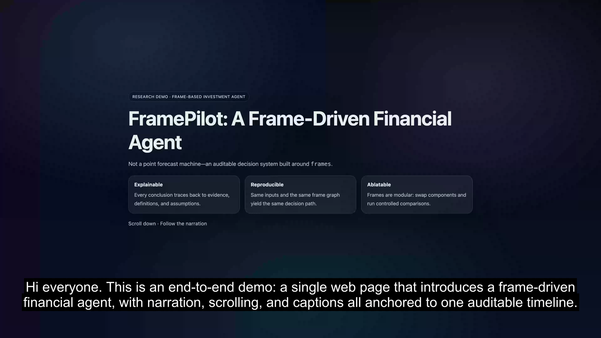
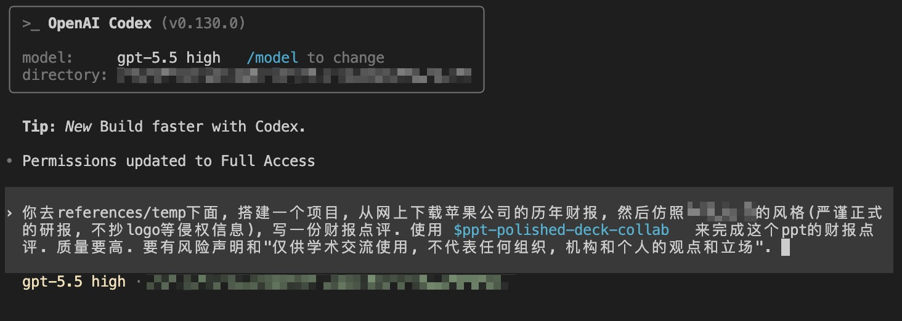

# presentation-skills

[English README](README.md)

**TL;DR。** `presentation-skills` 是一组面向真实交付的 production-grade skills，覆盖精修 PowerPoint deck、正式 Word 文档和可发布 demo 视频。

| Skill | 适合场景 | Demo 亮点 |
| --- | --- | --- |
| `ppt-polished-deck-collab` | 可编辑 executive deck、策略叙事、技术说明、研究汇报、中文正式研报 | 11 页 Apple FY2025 财报点评 deck，包含 Office 原生图表、原生表格、preview export 和 validation evidence |
| `word-polished-doc-collab` | 正式报告、董事会附件、研究附录、制度文档、咨询风格 Word 交付 | 中文轻量正式报告 + 英文精细咨询报告，包含 preview 和 QA bundle |
| `web-demo-video-synthesis` | 产品 walkthrough、网页 demo、带旁白解释视频、可发布短视频 | 网页、配音、字幕、录屏和最终 MP4 的端到端流水线 |
| `xhs-markdown-card-collab` | 从 Markdown 生成可发布的小红书图文卡片、研究/招聘帖子、结构化笔记型内容 | 导出的虚构 demo 成品，包含 PNG 卡片、预览 HTML、metadata JSON，以及在锁定字号合同下的主题变化示例 |

`presentation-skills` 是一个面向 agent / assistant 环境的开源 presentation 工具仓库。这里的重点不是“生成一页图”或“临时拼一版演示”，而是把 deck、doc 和 video 的生产过程变成可复跑、可编辑、可验证、可交付的完整流水线。

这些 skills 不是一轮 prompt 产物。它们经过了大量真实任务中的反复迭代、失败分析、产物复核和工作流重写，并且为此消耗了大量真实付费 token，才把流程、验证链和最终输出收敛到当前这个水平。

## Demo Gallery

| PowerPoint 研报型 demo | PowerPoint 策略叙事型 demo |
| --- | --- |
|  |  |
| 当前主展示 `ppt-polished-deck-collab` demo：正式财报点评 deck，包含原生图表、原生表格和验证证据链。 | 归档但仍然保留展示价值的 `ppt-polished-deck-collab` demo：策略叙事 deck，包含结构图、对比矩阵和管理层问题清单。 |

## Prompt 示例

这个 prompt 示例明确了 workspace 位置、数据来源、参考风格、免责声明和 `ppt-polished-deck-collab` 技能路线。Apple demo 展示的是从这类任务输入到可复跑研报工作区的完整产物，而不是一次性生成的单个 PPT 文件。

## 最近更新

- `2026-05-10` 在 README 中保留归档的 Standard Wars executive deck 作为第二个 `ppt-polished-deck-collab` 展示样例，并新增 contact sheet 资产链接到归档工作区。
- `2026-05-10` 将 `ppt-polished-deck-collab` 主展示 demo 替换为 Apple FY2025 财报点评 deck，覆盖 SEC 数据底稿、可编辑 Office 图表、原生表格、预览导出和 validation reports。
- `2026-05-10` 为 `ppt-polished-deck-collab` 增加中文正式材料的默认排版规则：中文宋体、英文 Times New Roman、正文小四、首行缩进、段前段后 `0.5` 行、正文 `1.5` 倍行距，以及财务表格对齐规则。
- `2026-04-22` `ppt-polished-deck-collab` 现在支持自动质量 gate，可以检查移动端打开风险、文本出格、对象遮挡和预览层排版失误，从而显著减少交付前的人类返工。
- `2026-04-22` `ppt-polished-deck-collab` 进一步收紧了 template-first 动线，现在模板审计、editable deck 构建、验证、预览导出和最终复核会按固定顺序执行。
- `2026-04-29` 新增 `word-polished-doc-collab`，把 Markdown、DOCX 与 Python 文档资产的往返协作抽象成独立 skill，并明确了中文宋体 / 楷体 / 黑体与英文 Times / Arial 的字体 profile、标题梯度、表题图题表注位置与质量 gate。
- `2026-04-30` 在 `demos/` 下正式注册两个 `word-polished-doc-collab` 门面样例：一个内容丰富的中文轻量正式报告 demo，一个带完整 preview 与 QA 证据链的英文精细咨询报告 demo。
- `2026-05-04` 新增 `xhs-markdown-card-collab`，把 Markdown 小红书图文卡片任务抽象成显式封面元数据、浏览器真实分页、已验证字号合同和反趋同风格指导的完整 workflow。
- `2026-05-05` 把 XHS 虚构 demo 从“只有源码示例”升级为 `demos/` 下的真实导出 bundle，每组都包含逐页 PNG、预览 HTML、metadata JSON 和明确的主题配置。

## 这个仓库提供什么

### `ppt-polished-deck-collab`

`ppt-polished-deck-collab` 用来生产可编辑、高质量、高度自动化的 PowerPoint deck，覆盖商业和学术两类用途。它既可以从零构建一整套 deck，也可以基于用户提供的模板工作，还可以继承用户已有 `pptx` 的母版和版式，并在保留可编辑性的前提下修改现有文件。

它适用于策略汇报、技术说明、研究汇报、论文答辩、产品演示、运营复盘、管理层 deck 等需要最终产物仍然表现为“真正 PowerPoint 文件”的场景。

### `word-polished-doc-collab`

`word-polished-doc-collab` 用来把 Markdown、DOCX 和 Python 生成的文档资产组织成正式、统一、可复跑的 Word 交付流程。它关注中英文字体组合、标题梯度、段前段后、行距、表题图题表注位置和交付证据，让 `.docx` 不只是导出成功，而是能经得住审阅。

它适用于合同、制度、说明文档、研究附录、业务报告、董事会或投委会附件等需要正式 Word 交付、且后续还要持续维护内容源的场景。

### `web-demo-video-synthesis`

`web-demo-video-synthesis` 用来高度自动化地生产带配音、带字幕、可直接发布的视频。它可以把文章、帖子、产品 walkthrough、网页 demo 和技术介绍转成适合 TikTok、小红书、Bilibili 等平台发布的视频内容。

它适用于技术介绍、商业 demo、产品解释、营销式演示和其他强调可复现、可迭代、产出速度快的视频生产场景。

### `xhs-markdown-card-collab`

`xhs-markdown-card-collab` 用来把 Markdown 或轻度结构化文本稳定地转成可发布的小红书图文卡片。它的重点是显式封面元数据、中文可读性、浏览器分页、视觉 QA，以及在保持已验证字号范围稳定的前提下做出不趋同的页面风格。

它适用于招聘/招生帖子、研究笔记、结构化观点卡片、产品说明和其他需要在手机端持续滑读的社交内容，而不是只要“导出几张 PNG”就算完成的场景。

## Skill 详情

### `ppt-polished-deck-collab`

这是仓库里当前主打的 deck 制作 skill。它不是一个“单页小工具”，而是一套 deck 级工作流。它负责规划叙事、生成 editable `pptx`、导出逐页预览、做结构验证，并为 review 和 handoff 产出证据 bundle。

核心能力：
- 基于 `brief.md`、`deck_narrative.md` 和派生 `slide_specs.yaml` 的 deck-first narrative 规划
- 基于 `python-pptx` 的 editable PowerPoint 生成
- 支持用户提供模板、继承 slide master / layout、以及修改现有 `pptx`
- 支持原生 Office chart、Python figure、原生表格、connector-backed diagram 和 icon accent
- 支持模板审计，以及 `package_preflight`、`structure_precheck`、`render_review` 三段式质量 gate
- 支持 validation bundle、预览导出和 evidence-driven final delivery

典型技术栈：
- 用 `python-pptx` 生成可编辑 PowerPoint 对象
- 用 PowerPoint 或 LibreOffice 导出高保真预览
- 用 `pptx XML` 做 connector 校验
- 用结构层和成图层质量 gate 做自动验证
- 用 `matplotlib` / `seaborn` / `pandas` 生成 Python figure

典型工作流：
- 如果有模板，先做模板审计
- 锁定 brief 和 narrative
- 构建 editable deck
- 执行 package 与 structure 两层质量 gate
- 执行模块级 validation
- 导出逐页预览
- 执行 render review
- 最后做 visual review 和 final handoff

展示样例：
- 当前研报型 demo：`demos/apple-financial-report-review/`
- 归档策略叙事型 demo：`old/demos/standard-wars-executive-deck/`

关键输出：
- `demos/apple-financial-report-review/final/apple_fy2025_financial_report_review.pptx`
- `demos/apple-financial-report-review/final/apple_fy2025_financial_report_review.pdf`
- `demos/apple-financial-report-review/build/rendered/contact_sheet.png`
- `demos/apple-financial-report-review/validation/package_preflight/history/`
- `demos/apple-financial-report-review/validation/structure_precheck/history/`
- `demos/apple-financial-report-review/validation/render_review/history/`

### `word-polished-doc-collab`

这是仓库里的 Word 文档协作 skill。它把松散的 Markdown 或 DOCX 草稿过程收敛成一套正式文档工作区：语义化 source、明确字体 profile、稳定题注规则、可复核 preview evidence，以及能解释交付质量的 QA 报告。

核心能力：
- 按 `lightweight` 与 `refined` 两条模式路由 Word 文档工作流
- 提供 `init_doc_workspace.py`、`check_word_environment.py`、`lint_doc_markdown.py`、`build_docx.py`、`export_docx_preview.py`、`run_docx_qa.py` 六个参考 CLI
- 围绕 `doc_workspace`、`canonical_markdown`、`style_profile` 和 `validation_bundle` 组织长期协作
- 支持 `docx -> markdown -> docx` 与 `markdown -> docx` 两类主路线
- 显式定义 `中文宋体 + 英文 Times New Roman` 的默认版式，以及 `楷体 + Times New Roman`、`黑体 + Arial` 和通用英文咨询 preset
- 固化正文 `小四 12pt`、正文与标题 `1.5` 倍行距、段前段后 `0.5` 行、表格 `五号 / 小五`、表题加粗与题注位置
- 为静态图片、Python figure 和未来的 Office 原生 chart / illustration 预留清晰的接入路线
- 定义 source integrity、style contract、font slot integrity、section layout、asset manifest integrity 和 visual review 多层质量 gate

典型工作流：
- 先根据正式程度、图表复杂度和验证要求选择 `lightweight` 或 `refined`
- 初始化干净 workspace
- 锁定语义 Markdown 和 active `style_profile`
- 在 build 前执行源语义 lint
- 生成 `.docx`，导出 preview evidence，并在需要时执行 QA
- 最后补 visual review 记录与交付证据

主展示 demo：
- `demos/word-lightweight-industrial-operations-brief/`
- `demos/word-refined-industrial-service-transformation/`

关键输出：
- `demos/word-lightweight-industrial-operations-brief/out/industrial_operations_brief.docx`
- `demos/word-lightweight-industrial-operations-brief/out/preview/industrial_operations_brief.pdf`
- `demos/word-refined-industrial-service-transformation/build/docx/industrial_service_transformation.docx`
- `demos/word-refined-industrial-service-transformation/temp/qa/qa_report.md`

关键文档：
- `word-polished-doc-collab/SKILL.md`
- `word-polished-doc-collab/references/principles.md`
- `word-polished-doc-collab/references/doc_workflow.md`
- `word-polished-doc-collab/references/typography_profiles.md`
- `word-polished-doc-collab/references/local_pipeline_case_study.md`

### `web-demo-video-synthesis`

这是仓库里当前主打的视频制作 skill。它会把源叙事转成一个可复现的 workspace，涵盖 TTS、时间轴、字幕、录制、混音和最终渲染。最终产物不是一次性导出，而是一套可以复核、可以编辑、可以重跑、可以发布的视频工作空间。

核心能力：
- 把 cues、文章或帖子转成 timeline-driven demo video
- 生成或接入分段音频、字幕和最终渲染结果
- 保留可复现 workspace，支持局部重跑和多轮迭代
- 面向 TikTok、小红书、Bilibili 等平台输出可发布视频

典型技术栈：
- 时间轴驱动的 workspace 编排
- TTS 与字幕生成
- 录屏与视频合成
- 带中间产物的可复现 MP4 渲染

典型工作流：
- 准备 workspace 和 cues
- 生成分段音频
- 构建 timeline
- 录制或合成视觉轨道
- 生成字幕
- 混合音视频
- 导出 final MP4

主展示 demo：
- `demos/web-demo-video-synthesis-financial-agent/`

公开视频：
- Bilibili: https://www.bilibili.com/video/BV1j6NwzaEDZ/

### `xhs-markdown-card-collab`

这是仓库里的小红书 Markdown 图文卡片 skill。它把内容轻量整理、封面配置、排版合同、分页规则和逐页视觉检查放在同一条 workflow 里，而不是把它拆成零散的 CSS 调参任务。

核心能力：
- 用 YAML front matter 显式定义封面标题、机构名、角色行、badge 和 highlights
- 优先通过补标题层级、标准列表和少量加粗来整理 Markdown，而不是重写原文
- 用浏览器真实排版处理中文正文、列表和英文串分页
- 把已经验证过的字号、留白、边框和面板参数固化成 typography lock
- 提供反趋同的风格变化方向，鼓励从主题 token、信息组织和装饰节奏做变化，而不是频繁推翻字号体系
- 提供封面密度、孤立标题、边框过宽、空页和移动端可读性的 QA 规则

关键文档：
- `xhs-markdown-card-collab/SKILL.md`
- `xhs-markdown-card-collab/references/workflow.md`
- `xhs-markdown-card-collab/references/typography_lock.md`
- `xhs-markdown-card-collab/references/style_directions.md`

## 仓库结构

- `ppt-polished-deck-collab/`：当前主线 polished deck skill
- `word-polished-doc-collab/`：当前主线 Word 文档协作 skill
- `web-demo-video-synthesis/`：当前主线 web demo 视频合成 skill
- `xhs-markdown-card-collab/`：当前主线小红书 Markdown 图文卡片 skill
- `demos/`：正式注册的 demo 工作空间
- `old/`：归档技能和历史 demo
- `assets/`：根 README 使用的预览图资产

## Demos

- 正式 polished deck demo：`demos/apple-financial-report-review/`
- 正式 Word 轻量 demo：`demos/word-lightweight-industrial-operations-brief/`
- 正式 Word 精细 demo：`demos/word-refined-industrial-service-transformation/`
- 正式 web demo synthesis demo：`demos/web-demo-video-synthesis-financial-agent/`
- 正式 XHS 招募型 demo：`demos/xhs-fictional-north-quay-lab-recruiting/`
- 正式 XHS 研究摘要型 demo：`demos/xhs-fictional-grid-storage-research-note/`
- 正式 XHS 产品说明型 demo：`demos/xhs-fictional-orbitops-product-explainer/`
- 正式 XHS 周报快评型 demo：`demos/xhs-fictional-ridership-weekly-brief/`
- 归档复杂图 demo：`old/demos/ppt-complex-diagram-collab-stock-architecture/`
- 归档 polished deck demo：`old/demos/ppt-polished-deck-collab-ai-market-intelligence/`
- 归档 polished deck demo：`old/demos/standard-wars-executive-deck/`

## XHS Demo 组

`xhs-markdown-card-collab` 现在在 `demos/` 下补了四组完全虚构但**已经导出成品**的样例，用来解释这个 skill 的 workflow 和风格变化方向，不依赖任何真实招生、研究或产品文案：

- `demos/xhs-fictional-north-quay-lab-recruiting/`：机构招募 / 招生型，正式成品主题为 `lumen`
- `demos/xhs-fictional-grid-storage-research-note/`：研究摘要 / 框架笔记型，正式成品主题为 `ink`
- `demos/xhs-fictional-orbitops-product-explainer/`：产品说明 / 能力解释型，正式成品主题为 `clay`
- `demos/xhs-fictional-ridership-weekly-brief/`：周报快评 / 数据摘要型，正式成品主题为 `ink`
