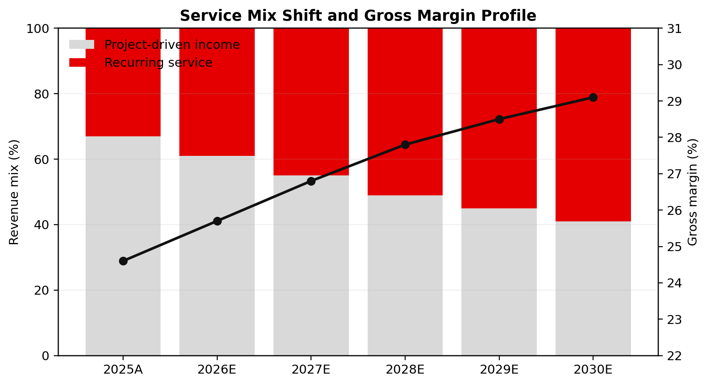
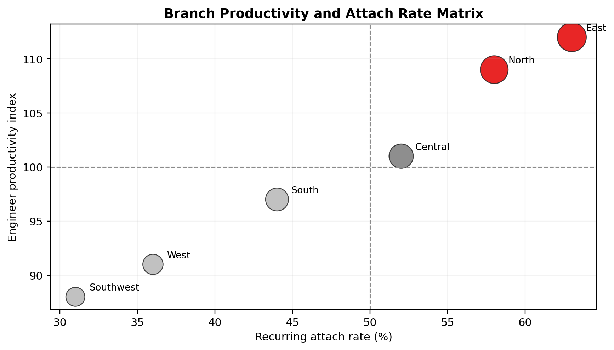

# 星澜工业服务运营改善与区域协同简报

副标题：2026-04-30 | 虚构案例 | Lightweight demo for formal Chinese Word delivery

导语：这份轻量模式 demo 用来展示 `word-polished-doc-collab` 在“不引入重型 workspace 约束”的前提下，依然可以把一份内容充实的中文正式文档稳定落成可交付的 `.docx` 与 `.pdf`，同时保持段落首行缩进、表题加粗、表格对齐和图片题注节奏清楚。

## 执行摘要

星澜工业服务股份有限公司是一家虚构的工业后市场服务商，主营现场维保、备件保障、远程诊断和节能改造。过去两年公司收入增长较快，但区域协同、工程师排班和合同结构没有同步优化，导致收入规模扩大后，毛利率、空驶率和回款效率反而出现波动。

本简报的核心判断是：公司当前最需要修复的不是市场需求，而是“区域协同失灵 + 合同结构失真 + 现场排班粗放”三件事叠加造成的经营噪音。如果管理层在未来 180 天内同步推进调度治理、合同分层和备件参数治理，预计现场服务毛利率可从 21% 提升到 27%，工程师空驶率可从 18% 降到 11%，库存周转天数可下降约 9 天。

## 当前经营诊断

公司最大的经营矛盾是高波动收入占比过高。2025A 时点，紧急维修类收入仍占 44%，这类业务虽然能在短期内填满排班表，但也带来了高峰期加班、备件急采和低价值工单挤占高等级工程师的问题。与此同时，预防性维保和远程监测的复购率明显更高，却因为销售激励和交付组织没有对齐，始终没有拿到足够资源。

从区域维度看，北区签约能力最强，但工单分级粗放，导致高毛利合同没有稳定兑现。华东区客户关系最好，却没有把预防性维保打包成标准合同。西南区价格折扣过深，低于总部建议带宽，进一步拖累了续签质量和现金周转。

表 1 关键经营诊断与外部标杆对比
| 指标 | 星澜 2025A | 外部标杆 | 差距 |
| --- | ---: | ---: | ---: |
| 现场服务毛利率 | 21% | 28% | -7pct |
| 紧急维修收入占比 | 44% | 27% | +17pct |
| 工程师空驶率 | 18% | 10% | +8pct |
| 备件周转天数 | 73 | 52 | +21 天 |
| 预防性套餐渗透率 | 31% | 55% | -24pct |
表注：外部标杆为虚构同业样本中位数，用于说明改善方向，不对应真实行业数据库。

图 1 服务结构与毛利率改善轨迹
图注：图中保留英文指标字段名，模拟一线经营看板直接出图的常见输入形式。
来源：项目组基于虚构经营假设整理。

从结果上看，问题已经不是“多签几个单子能不能解决”，而是“什么样的收入值得继续扩大”。只有把高波动项目收入逐步迁移到 recurring service，现场组织才有机会在不继续堆人和加班的情况下改善利润。

## 区域协同与服务组合

区域协同失灵主要体现在三件事上。第一，派工规则仍按属地行政边界执行，没有把工程师技能、客户 SLA 和跨区交通时间放到同一套决策里。第二，服务产品包定义不清，同样的维保合同在不同区域被卖成不同版本，导致交付复杂度持续上升。第三，备件策略仍基于历史经验补货，没有和设备装机密度、故障频率和调拨成本联动。

- 北区应优先治理派工与工单分级，让高等级工程师回到高价值合同。
- 华东区应把高复购客户沉淀成标准预防性套餐，形成续签模板。
- 西南区应收紧折扣审批，先修复低毛利客户结构，再扩大新签。

表 2 区域运营画像与建议动作
| 区域 | 收入占比 | 主要问题 | 优先动作 | 180 天目标 |
| --- | ---: | --- | --- | --- |
| 北区 | 34% | 排班粗放，空驶率高 | 重做工单分级与跨区派工 | 空驶率下降 5pct |
| 华东区 | 27% | 套餐标准化不足 | 固化续签模板与 upsell 话术 | 套餐渗透率提升至 45% |
| 华南区 | 18% | 备件调拨频繁 | 重算安全库存与补货带宽 | 备件周转天数下降 6 天 |
| 西南区 | 21% | 折扣过深，低毛利客户多 | 收紧授权并重算底价红线 | 新签合同毛利率提升 2pct |
表注：区域画像和目标均为虚构案例输入，用于测试轻量模式下的多列表格与条目对齐。

图 2 分公司生产率与服务渗透率矩阵
图注：横轴为 recurring attach rate，纵轴为 engineer productivity，用于区分扩张、治理和修复优先级。
来源：项目组基于 6 个虚构分公司的经营画像整理。

## 百日行动与治理节奏

轻量模式不适合承载完整咨询项目的证据链，但足以把管理层最需要看的百日动作落清楚。建议先按“先修复经济性，再扩大增长”的顺序推进，而不是把所有区域同时拉进大而全的转型计划。

表 3 百日行动计划摘要
| 工作流 | 负责人 | 30 天动作 | 100 天目标 |
| --- | --- | --- | --- |
| 调度治理 | COO | 建立跨区域派工看板，统一工单分级 | 工程师空驶率下降 4pct |
| 定价治理 | 商业负责人 | 收紧低毛利折扣审批，设定红线客户清单 | 新签合同毛利率提升 2pct |
| 服务产品化 | 解决方案负责人 | 推出预防性维保标准包 | 续签套餐渗透率提升至 40% |
| 备件治理 | 供应链负责人 | 清理慢动件与跨仓调拨规则 | 周转天数下降 8 天 |
表注：表中目标是本次虚构案例中的咨询建议输出，用于验证轻量模式的表题、表注和表格对齐规则。

为了避免治理动作再次沦为报表工程，管理层每两周应固定复盘四项指标：高波动收入占比、工程师空驶率、续签套餐渗透率和库存周转天数。所有区域都应围绕这四项指标讲同一套语言，而不是各自发明指标口径。

## 财务效果与执行边界

如果百日动作按节奏推进，公司最先感受到的改善会发生在毛利率和排班效率，而不是收入规模本身。收入的改善更多会在第二轮合同续签时释放，因此短期 KPI 不应只盯签约额，还必须同时看合同质量和交付稳定性。

表 4 目标状态财务影响摘要
| 指标 | 当前状态 | 180 天目标 | 改善幅度 |
| --- | ---: | ---: | ---: |
| 现场服务毛利率 | 21.0% | 27.0% | +6.0pct |
| 工程师空驶率 | 18% | 11% | -7pct |
| 套餐渗透率 | 31% | 43% | +12pct |
| 库存周转天数 | 73 | 64 | -9 天 |
| 调整后 EBITDA margin | 11.2% | 14.8% | +3.6pct |
表注：这里的当前状态与目标状态均不对应真实公司，仅用于测试轻量模式下的正式中文版式与交付节奏。

- 如果区域总经理仍保留过大的价格豁免权，折扣治理会失效。
- 如果总部没有同步统一工单分级，调度看板只会变成新的报表负担。
- 如果一线数据口径持续漂移，后续升级到 refined 模式时，自动 QA 也无法建立在稳定 source 之上。

这份 demo 是纯虚构案例，用于展示 `word-polished-doc-collab` 在轻量模式下如何处理一份内容丰富、结构清楚、带表格和图片的正式中文 Word 文档，不构成真实咨询建议或投资判断。
