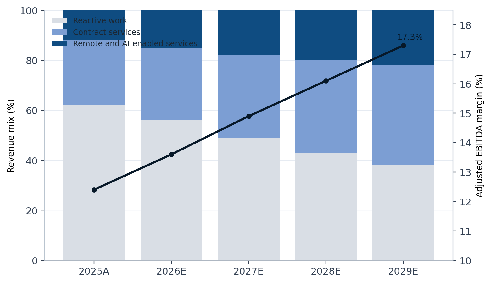
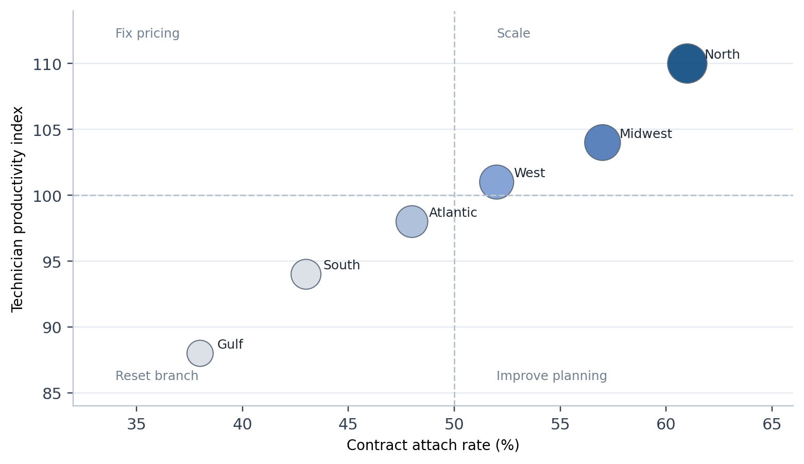
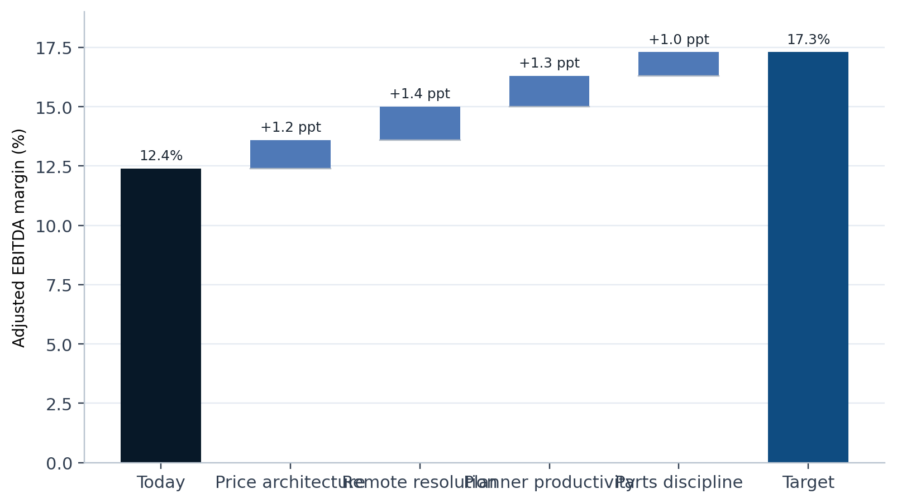

# How Helios Industrial Services can turn AI-enabled field operations into higher-quality growth

Subtitle: April 2026 | Fictional consulting report | Teal consulting preset validation

Lead: Helios Industrial Services has built scale in maintenance, remote monitoring, and retrofit work, yet its economics have not improved at the same pace as revenue. This refined English sample tests whether a section-switched consulting layout, restrained teal exhibit system, and fully traceable QA bundle can produce a premium consulting deliverable with clean Markdown semantics.

## Executive summary

Helios has a credible market position in midmarket industrial maintenance, especially in power, water, and cold-chain facilities where uptime matters more than lowest-price procurement. Over the past three years the company expanded through emergency response projects, bolt-on digital monitoring services, and a heavier field footprint. Revenue grew quickly, but margin quality did not. The company now faces a familiar consulting problem: more activity, more technicians, and more dispatches, yet too little contract quality and too much operational noise.

Our central judgment is that Helios should stop treating AI as an isolated technology program and instead use it to redesign the commercial and operating spine of the service business. The value does not come from a chatbot or an analytics dashboard alone. It comes from linking three moves at the same time: migrating customers from reactive work to recurring contracts, increasing remote resolution before a truck roll is approved, and tightening branch-level planner discipline so technician time is sold into the highest-value demand.

If Helios executes these moves over the next twelve months, we estimate that recurring revenue mix can rise from 38 percent to 54 percent, technician productivity can improve by roughly 11 percent, and adjusted EBITDA margin can expand from 12.4 percent to 17.3 percent. The transformation logic is straightforward. Better contract quality reduces dispatch volatility. Lower volatility makes planner decisions more rational. Better planning allows the company to serve more demand remotely or through higher-yield onsite work rather than through low-margin emergency calls.

## Why the current growth model is not translating scale into value

Helios still relies too heavily on reactive field work. Emergency jobs remain attractive to branch leaders because they fill the calendar immediately and create visible top-line wins, but they also create rush procurement, overtime labor, and avoidable travel. At the same time, remote diagnostics and preventive service bundles are underpenetrated even though they renew at higher rates and create cleaner data on asset health. In effect, the company is paying for digital capability but not yet capturing the operating leverage that digital capability should create.

Table 1  Current economics by service line
| Service line | Revenue share | Gross margin | Renewal rate | Cash conversion cycle |
| --- | ---: | ---: | ---: | ---: |
| Emergency response | 35% | 19% | 22% | 92 days |
| Preventive maintenance contracts | 41% | 31% | 76% | 55 days |
| Remote diagnostics and AI monitoring | 14% | 46% | 84% | 43 days |
| Retrofit and energy optimization | 10% | 27% | 29% | 79 days |
Notes: All metrics are fictional case inputs designed to test table treatment under the refined preset workflow.

The branch review shows the same pattern. High-performing branches are not merely selling more. They are selling a more stable mix, planning labor against a cleaner demand base, and using remote triage to suppress unnecessary visits. Lower-performing branches often have reasonable market potential, but their discounting thresholds are loose, planner roles are administrative rather than economic, and service packages are too bespoke to scale efficiently.

Exhibit 1  Subscription and remote service mix can expand margin without increasing field complexity

Notes: Reactive work declines as recurring contracts and remote diagnostics scale, allowing margin expansion without a proportional increase in dispatch volatility.
Source: Helios management interviews and team analysis based on fictional assumptions.

This is why the transformation should begin with economics, not with tooling. AI-enabled remote resolution matters because it changes the demand that reaches the field organization. A better planner cockpit matters because it helps the branch make daily trade-offs among response time, travel, technician skill, and contract value. The technology stack is part of the answer, but only when the commercial model and branch routines are redesigned around it.

## What the target operating model should look like

The next operating model for Helios should rest on three linked design choices. First, the company needs a cleaner commercial architecture built around a limited set of recurring service packages, each with explicit response standards, remote support rules, and spare-parts coverage boundaries. Second, the branch operating model needs an economic planner role with authority to sequence work against margin and SLA commitments rather than simply confirm technician availability. Third, the central team needs a small performance office that reviews branch attach rate, remote resolution, overtime, rework, and dispatch-to-quote conversion in one cadence.

Exhibit 2  Branch archetypes show where to scale, fix, and reprice

Notes: The matrix distinguishes branches that are ready to scale from branches that need pricing, scheduling, or service-package repair before further growth.
Source: Helios operating review based on six fictional branch archetypes.

The operating implication is that branches should not all be asked to do the same thing at the same time. A branch with strong attach rates and good technician productivity should scale recurring contracts aggressively. A branch with weak productivity but healthy demand should focus on planner discipline and route design before adding capacity. A branch with weak attach and weak productivity should not receive more lead flow until pricing, package design, and branch leadership are reset.

Table 2  Twelve-month transformation roadmap
| Wave | Timing | Core moves | Primary owner | Expected business effect |
| --- | --- | --- | --- | --- |
| Wave 1 | 0-90 days | Tighten discount rules, launch remote triage gate, define planner scorecard | COO and chief commercial officer | Lower avoidable truck rolls and cleaner quote quality |
| Wave 2 | 90-180 days | Simplify service packages, redesign branch planning cadence, reset branch incentives | Service line leader and regional VPs | Higher recurring attach rate and better labor yield |
| Wave 3 | 180-365 days | Scale AI workbench, unify parts logic, expand renewal playbooks | CEO, CTO, and supply chain lead | Better margin, renewal performance, and cash discipline |
Notes: The roadmap favors economic repair before growth acceleration so that later scale lands on a more stable operating base.

## How much value is at stake

Under the base case, the largest single value lever is not labor cost reduction. It is the mix shift toward higher-quality recurring work. Once the customer base moves into clearer service packages, remote diagnostics can absorb a larger share of fault detection, planners can reduce unnecessary travel, and branches can increase first-time fix rates without adding the same volume of premium labor hours. The combined effect is an economic model that is simpler to manage and more attractive to scale.

Exhibit 3  Margin bridge from today’s baseline to the next steady state

Notes: The bridge isolates the margin effect of price architecture, remote resolution, planner productivity, and spare-parts discipline.
Source: Transformation office estimate based on fictional management assumptions.

Table 3  Target-state value capture summary
| Metric | Current state | 12-month target | Change |
| --- | ---: | ---: | ---: |
| Recurring revenue mix | 38% | 54% | +16 ppt |
| Remote resolution rate | 9% | 27% | +18 ppt |
| Technician productivity index | 100 | 111 | +11% |
| Adjusted EBITDA margin | 12.4% | 17.3% | +4.9 ppt |
| Cash conversion cycle | 71 days | 56 days | -15 days |
Notes: The target state is a fictional planning scenario used only to validate refined-mode styling, asset routing, and QA evidence.

Even in the base case, the economics improve only if governance stays tight. The company should therefore avoid launching a broad “AI transformation” narrative that creates activity without discipline. Instead, every initiative should map back to a small number of branch and contract metrics that determine whether scale is becoming more valuable or merely more complex.

## What the CEO should govern over the next four quarters

- Set one recurring revenue ambition and make it visible in every branch review.
- Require every onsite dispatch above a defined threshold to pass through a remote-triage decision rule.
- Review planner productivity, overtime, and first-time fix as economic measures, not administrative measures.
- Protect package standardization against custom deal pressure from large customers.
- Keep the transformation office small and analytical so that it acts as a control tower rather than a parallel operating organization.

This report is entirely fictional and exists only to test the refined English preset path and the `teal_consulting_report` layout of `word-polished-doc-collab`. It does not represent real advice, a real company, or any investment recommendation.
