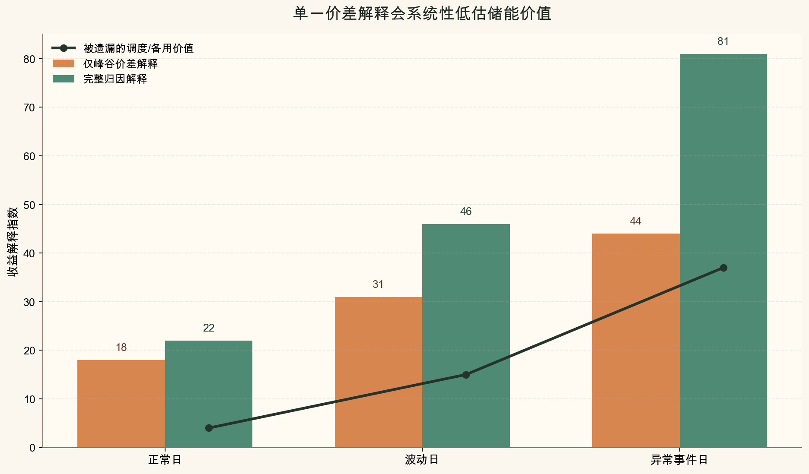

# 为什么储能项目复盘不能只看峰谷价差

## 先说结论

如果只用峰谷价差解释储能收益，就会把一部分真正重要的调度价值、备用价值和系统约束成本全部压平。

用更紧一点的写法，可以把这个判断记成一个研究型卡片里足够常见的表达：

$$
V_{\text{full}, t} = V_{\text{spread}, t} + V_{\text{dispatch}, t} + V_{\text{reserve}, t} + \varepsilon_t
$$

如果复盘里只保留 $V_{\text{spread}, t}$，最后得到的往往只是一个过度简化的故事。

## 这个问题为什么重要

很多项目复盘最后只留下一个简单结论：价差够不够大。

这种看法的问题在于，它默认收益只来自单次买低卖高，而忽略了调度窗口、负荷形态、局部拥堵和异常事件响应。

## 一个更稳的分析框架

1. 先把运营周期拆成正常日、波动日和异常事件日。
2. 再按每个时间片记录调度动作、约束条件和可替代策略。
3. 然后把收益拆成价差收益、约束缓释收益和保底策略收益。
4. 最后比较“简单价差解释”和“完整归因解释”的偏差。

## 一张图先把价值缺口讲清楚

这张图对应的意思很直接：越到异常事件日，**只看峰谷价差** 和 **完整归因解释** 的差距越大，被遗漏的调度 / 备用价值也越明显。

如果只想保留一个最小可沟通公式，可以用下面这个 gap 定义：

$$
\text{Gap}_t = V_{\text{full}, t} - V_{\text{spread}, t}
$$

对于研究卡片来说，这种“一张图 + 一个 gap 公式”的组合比长段概念解释更适合手机端阅读。

## 这个框架会带来什么

1. 能更早发现策略其实在依赖少量异常日。
2. 能区分“项目逻辑正确”和“只是恰好碰上好时点”。
3. 能让后续策略迭代更像研究，而不是只做结果复述。

## 适合怎么写成卡片

建议把第一页做成问题定义与核心结论，后面几页分别承接：

1. 现象
2. 误区
3. 框架
4. 复盘启发

## 一句话总结

**储能复盘如果只看峰谷价差，最后得到的大多是一个过度简化的故事。**
