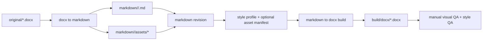

# Document Workflow

**这份文档的定位。** 本文定义 `word-polished-doc-collab` 的精细模式默认 workspace 结构、`docx <-> markdown <-> docx` 的协作流程，以及表题、图题、表注、图注和来源说明在 Markdown 中的稳定语义约定。

## 推荐 workspace

**轻量模式优先使用最小 workspace。** 对单篇、快速、弱验证任务，优先使用 `lightweight_mode.md` 里的 `doc.md + assets + out` 结构，不要被精细模式目录拖重。

**工作区应该把“来源、编辑、构建、验证”分开。** 推荐结构如下：

```text
doc-workspace/
├── original/
├── markdown/
│   └── <doc-slug>/
│       ├── <doc-slug>.md
│       ├── assets/
│       ├── meta.json
│       └── [asset_manifest.json]
├── build/
│   └── docx/
├── scripts/
└── temp/
```

**`asset_manifest.json` 只在复杂视觉资产出现时引入。** 多张图表、Office 原生对象、Python figure、来源说明和 preset 级图文系统都属于“该文件该出现”的信号；不要在纯文本或极简图片文档里为凑结构硬塞一个空 manifest。

**`scripts/` 目录建议只放宿主自己的包装命令。** 如果宿主项目还没有本地实现，可以直接调用 skill 自带的参考脚本；只有当项目需要额外的资产生成、模板 patch 或一键编排时，再在 workspace 内补自己的 `scripts/`。

## 数据流



## 默认工作流

**第一步是锁 source of truth。** 新收到的外部 Word 文档先归档到 `original/`。如果当前文档已经在 Markdown 里人工持续维护，就不要反复用原件覆盖它。

**第二步是保留 Word 的结构语义。** 抽取到 Markdown 时优先保留标题、正文、列表、表格和图片顺序。不要为了“导出更快”就把表格改成截图或把图片说明揉进上一段正文。

**第三步是只在 Markdown 里做持续编辑。** 文本修改、结构调整、表题表注补齐、图片替换都优先在 Markdown 层完成。导出的 `.docx` 是交付物，不是长期维护源。

**第四步是先锁 `style_profile`，并在需要时补上 `asset_manifest`。** 精细模式应在构建前明确 active style、caption 位置；只要文档开始混用多张图、多种资产模式、来源说明或可编辑对象要求，就把这些信息写进 `asset_manifest`。

**第五步是把版式映射放在构建器。** 统一字体、字号、首行缩进、行距、段前段后、caption 位置、图注来源说明和表格密度都应在构建阶段集中设置，而不是由作者手工在 Markdown 中模拟。

**第六步是导出后复核。** 精细模式默认强制复核标题层级、表格宽度、图片缩放、分页、字体槽位和资产可编辑性。轻量模式只有在用户明确要求 review 时才执行这一步。

## 参考脚本

**这套 skill 现在提供一条可直接执行的参考脚本链。** 推荐顺序如下：

```bash
python scripts/check_word_environment.py
python scripts/init_doc_workspace.py <workspace-dir> --mode refined --doc-slug <doc-slug>
python scripts/lint_doc_markdown.py --meta markdown/<doc-slug>/meta.json
python scripts/build_docx.py --meta markdown/<doc-slug>/meta.json
python scripts/export_docx_preview.py --meta markdown/<doc-slug>/meta.json
python scripts/run_docx_qa.py --meta markdown/<doc-slug>/meta.json
```

**不要把这些脚本理解成一个黑盒 pipeline。** 它们分别覆盖环境探测、workspace 初始化、源语义 lint、DOCX 构建、preview 导出和自动 QA 六件事。这样做的好处是每一步失败都能暴露清楚，不需要在一个万能脚本里倒查上下文。

## Markdown 语义约定

**标题和正文使用标准 Markdown。** `#` 到 `###` 对应主要标题层级，普通段落对应正文，`-` 和 `1.` 对应列表，pipe table 对应表格。

**表题使用单独段落并位于表上方。** 推荐写法：

```md
表 1 费用分摊明细

| 项目 | 金额 |
| --- | ---: |
| 管理费 | 100 |
| 托管费 | 20 |
```

**表题语义由“相对位置 + 编号样式”共同决定。** 单独成段、紧邻表格上方，并且文本本身符合 `表 1 ...`、`表 3-2 ...` 这类编号题注样式时，应被识别成 `table_title`，而不是普通正文。

**表注使用单独段落并位于表下方。** 推荐写法：

```md
表注：金额单位为人民币万元，数据截至 2026-04-29。
```

**图题使用单独段落，位置跟随 active `caption_policy`。** `cn_song_times` 默认位于图片下方，某些 preset 可以显式要求图上方。默认中文正式文档推荐写法如下：

```md


图 1 费用审批流程
```

**图题语义同样优先依赖“相对位置 + 编号样式”。** 单独成段、紧邻图片上方或下方，并且文本本身符合 `图 1 ...`、`Exhibit 2 ...` 等题注样式时，应被识别成 `figure_title`。

**图注和来源说明要独立成段。** 推荐写法：

```md
图注：样本区间为 2021-2025 年，口径为合并报表。
来源：公司公告，团队测算。
```

**`figure_note` 和 `source_note` 不应揉进图像本体。** 它们是文档语义块，不是图片像素的一部分。

**图表资产要相对引用。** 图片、Python figure 和未来的导出图都应放在文档目录的 `assets/` 下，并通过相对路径引用，保证工作区可搬运。

**Markdown 不要手工模拟中文首行缩进。** 正文段落不需要写前导空格或全角空格，首行缩进应由构建器按中文正式文档规则统一落地。

## `meta.json` 的职责

**`meta.json` 负责绑定来源和输出。** 推荐至少保存：
- `source_docx`
- `markdown_file`
- `assets_dir`
- `output_docx`
- `style_profile`
- `workflow_mode`

**`style_profile` 应该进入元数据。** 这样构建脚本才能知道这份文档默认用 `cn_song_times`、`cn_kaiti_times` 还是 `cn_heiti_arial`。

## `asset_manifest.json` 的职责

**`asset_manifest.json` 负责绑定复杂视觉资产。** 它只在文档存在非平凡视觉资产时出现，推荐至少保存：
- `asset_id`
- `asset_mode`
- `source_file` 或 `generator_script`
- `caption_position`
- `figure_note`
- `source_note`
- `editable_required`

**`asset_manifest` 是精细模式的重要抓手。** 只要文档里有多张图、多种资产模式、Office 原生对象、来源说明或 preset 式图文系统，就不应再靠隐式约定管理这些资产。

## 适合自动化的部分

**结构抽取适合自动化。** 段落、标题、表格、图片、元数据、图注和来源说明的抽取与回写，适合脚本处理。

**版式映射适合自动化。** 正文字号、标题梯度、表格密度、caption 位置、图注来源说明和字体槽位，适合统一写在构建器里。

**最终视觉判断仍需要人工。** 页尾孤行、超宽表格、图片模糊、分页位置和法务类特殊格式，仍应人工复核。
