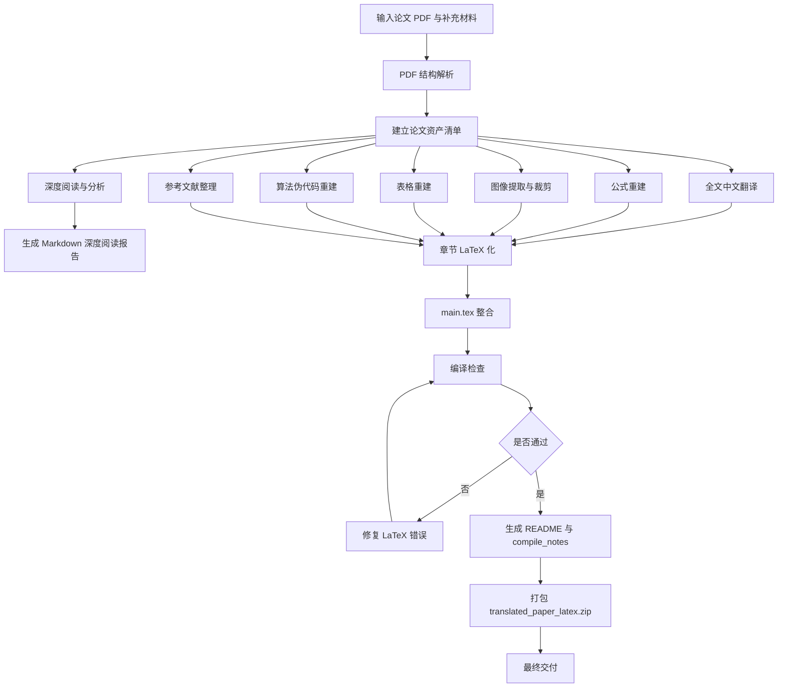

# 期刊论文深度阅读、中文翻译与 LaTeX 重建一体化工作流

## 0. 工作流定位

本工作流用于将一篇英文期刊论文 PDF 系统处理为两类成果：

1. **学术论文深度阅读与分析报告**
   - 用于理解论文的研究背景、问题定义、方法设计、实验验证、贡献不足和可借鉴之处。
   - 最终输出 Markdown 格式的深度阅读报告。

2. **中文翻译版 LaTeX 重建项目**
   - 将论文全文翻译为中文；
   - 重建公式、图表、算法、参考文献；
   - 提取 PDF 中的图片；
   - 最终输出可上传至 Overleaf 并使用 XeLaTeX 编译的完整 LaTeX 项目。

最终目标不是简单摘要，而是完成从“论文理解”到“论文重建”的完整闭环。

---

## 1. 输入与输出

### 1.1 输入文件

必须输入：

```text
paper.pdf
```

可选输入：

```text
supplementary.pdf
appendix.pdf
figures.zip
source.zip
data_description.pdf
```

如果论文存在补充材料、附录、额外图表、数据说明或代码说明，应一并纳入处理。

---

### 1.2 输出文件

最终建议输出两个主要成果：

```text
paper_deep_reading_report.md
translated_paper_latex.zip
```

其中：

```text
translated_paper_latex.zip
```

解压后应包含：

```text
translated_paper_latex/
├── main.tex
├── references.bib
├── figures/
│   ├── fig1.png
│   ├── fig2.png
│   └── ...
├── tables/
│   └── optional_table_notes.md
├── sections/
│   ├── 00_abstract.tex
│   ├── 01_introduction.tex
│   ├── 02_related_work.tex
│   ├── 03_method.tex
│   ├── 04_experiments.tex
│   ├── 05_results.tex
│   ├── 06_discussion.tex
│   ├── 07_conclusion.tex
│   └── appendix.tex
├── README.md
└── compile_notes.md
```

---

## 2. 总体执行顺序



---

## 3. 阶段一：PDF 结构解析

### 3.1 目标

在正式分析、翻译和 LaTeX 重建前，先完整识别论文结构，避免遗漏章节、图表、公式、算法和参考文献。

### 3.2 执行内容

从 PDF 中提取并核对以下内容：

1. 论文基本信息：
   - 英文标题；
   - 作者；
   - 作者机构；
   - 发表年份；
   - 期刊或会议；
   - DOI；
   - 摘要；
   - 关键词。

2. 章节结构：
   - Introduction；
   - Related Work；
   - Method / Methodology；
   - Experiments；
   - Results；
   - Discussion；
   - Conclusion；
   - Acknowledgement；
   - References；
   - Appendix。

3. 编号元素：
   - Figures；
   - Tables；
   - Equations；
   - Algorithms；
   - Appendix Figures；
   - Appendix Tables。

4. 其他内容：
   - 脚注；
   - 术语定义；
   - 数据说明；
   - 实验设置；
   - 消融实验；
   - 敏感性分析；
   - 补充材料引用。

### 3.3 输出文件

```text
paper_structure.md
```

推荐结构：

```markdown
# PDF 结构解析结果

## 1. 论文基本信息

## 2. 章节结构

## 3. 图清单

## 4. 表清单

## 5. 公式清单

## 6. 算法清单

## 7. 参考文献清单

## 8. 疑似识别错误或不确定内容
```

### 3.4 验证标准

- 所有章节均已识别；
- 图、表、公式、算法编号基本连续；
- 正文中的图表引用能在清单中找到；
- PDF 页眉、页脚、页码未混入正文；
- 参考文献区域已完整提取；
- 不确定位置已记录。

---

## 4. 阶段二：论文资产清单建立

### 4.1 目标

建立论文中所有可处理对象的清单，为后续深度阅读、翻译和 LaTeX 重建提供依据。

### 4.2 资产清单模板

```markdown
# 论文资产清单

| 类型 | 编号 | 原始标题/说明 | 所在页码 | 后续处理方式 | 不确定性 |
|---|---|---|---|---|---|
| Figure | Fig. 1 | 原图题 | p. X | 提取为图片 | 无 |
| Table | Table 1 | 原表题 | p. X | LaTeX 重建 | 无 |
| Equation | Eq. 1 | 公式用途 | p. X | LaTeX 重建 | 无 |
| Algorithm | Alg. 1 | 算法名称 | p. X | LaTeX 重建 | 无 |
| Reference | [1] | 文献信息 | p. X | BibTeX 整理 | DOI 待核对 |
```

### 4.3 输出文件

```text
asset_inventory.md
```

### 4.4 验证标准

- 图表清单与正文引用一致；
- 公式清单与正文编号一致；
- 算法清单与正文编号一致；
- 参考文献清单完整；
- 每个对象都有明确处理方式。

---

# 第一部分：学术论文深度阅读与分析工作流

## 5. 阶段三：论文基本信息分析

### 5.1 输出内容

在 Markdown 报告中输出：

```markdown
## 一、论文基本信息

1. 论文题目：
2. 作者与机构：
3. 发表年份与期刊/会议：
4. 研究领域：
5. 关键词：
6. 论文类型：
   - 理论研究 / 方法研究 / 实证研究 / 综述 / 系统设计 / 案例研究 / 其他
```

### 5.2 分析要求

- 不确定信息必须标注“论文中未说明”；
- 不要根据外部常识补造作者机构、发表来源或 DOI；
- 如果 PDF 首页信息不完整，应在“不确定项”中说明。

---

## 6. 阶段四：研究背景与问题分析

### 6.1 输出内容

```markdown
## 二、研究背景与问题

1. 这篇论文研究的现实背景是什么？
2. 作者试图解决什么核心问题？
3. 这个问题为什么重要？
4. 现有研究或方法存在什么不足？
5. 论文的研究对象、研究范围和应用场景是什么？
```

### 6.2 分析逻辑

需要按照以下顺序展开：

```text
现实背景 → 研究痛点 → 核心问题 → 现有不足 → 研究对象与应用场景
```

### 6.3 验证标准

- 背景分析必须来自论文原文；
- 问题定义必须明确；
- 不能只写“具有重要意义”这类空泛表述；
- 应指出作者具体批评了哪些现有方法或研究空白。

---

## 7. 阶段五：研究目标与核心观点分析

### 7.1 输出内容

```markdown
## 三、研究目标与核心观点

1. 论文的主要研究目标是什么？
2. 作者提出了哪些核心观点或假设？
3. 论文最终想证明什么？
4. 请用一句话概括这篇论文的核心思想。
```

### 7.2 分析要求

- 明确区分“研究目标”“核心假设”“最终结论”；
- 如果论文没有显式提出假设，应标注“论文中未明确提出假设”；
- 一句话概括应高度凝练，不超过 80 字。

---

## 8. 阶段六：文献综述与理论基础分析

### 8.1 输出内容

```markdown
## 四、文献综述与理论基础

1. 作者引用了哪些重要研究方向？
2. 这些文献大致可以分为哪几类？
3. 每一类文献主要解决什么问题？
4. 作者如何评价已有研究？
5. 这篇论文基于哪些理论、模型、框架或方法？
```

### 8.2 推荐分类方式

可根据论文内容将文献分为：

```text
基础理论类
方法模型类
应用场景类
数据集与实验类
对比基线类
综述与评价类
```

### 8.3 验证标准

- 不能简单罗列参考文献；
- 必须说明每类文献与本文研究问题之间的关系；
- 必须指出作者如何从已有研究过渡到本文方法。

---

## 9. 阶段七：方法与技术路线分析

### 9.1 输出内容

```markdown
## 五、方法与技术路线

1. 总体研究框架是什么？
2. 方法流程可以分为哪几个步骤？
3. 每一步的输入、处理过程和输出是什么？
4. 如果论文包含数学模型、算法或公式，请解释：
   - 每个变量的含义；
   - 公式解决的问题；
   - 公式之间的逻辑关系；
   - 方法为什么这样设计。
5. 如果论文使用了机器学习、深度学习、统计模型或优化算法，请说明：
   - 使用了什么模型；
   - 输入特征是什么；
   - 目标变量是什么；
   - 损失函数或评价指标是什么；
   - 模型训练、验证和测试方式是什么。
6. 请用通俗语言解释该方法的运行逻辑。
```

### 9.2 方法分析模板

```markdown
### 5.X 方法模块：模块名称

#### 1. 模块目标

#### 2. 输入

#### 3. 处理过程

#### 4. 输出

#### 5. 关键公式

$$
公式
$$

其中：

- $x$：变量含义；
- $\theta$：变量含义。

#### 6. 设计原因

#### 7. 与前后模块的关系
```

### 9.3 技术路线图模板


### 9.4 验证标准

- 每个模型模块均解释清楚；
- 每个公式都有变量解释；
- 公式之间的逻辑关系明确；
- 方法设计原因不能停留在“提高性能”；
- 应说明方法如何对应研究问题。

---

## 10. 阶段八：数据与实验设计分析

### 10.1 输出内容

```markdown
## 六、数据与实验设计

1. 论文使用了什么数据？
2. 数据来源是什么？
3. 数据规模如何？
4. 数据包含哪些主要变量？
5. 数据预处理方法有哪些？
6. 实验如何设计？
7. 是否有对照实验、消融实验或敏感性分析？
8. 评价指标是什么？这些指标为什么合适？
```

### 10.2 实验设计分析表

```markdown
| 实验类型 | 实验目的 | 对比对象 | 评价指标 | 支撑的研究问题 |
|---|---|---|---|---|
| 主实验 | 验证总体性能 | 基线模型 | 指标名称 | 核心问题 |
| 消融实验 | 验证模块有效性 | 去除某模块 | 指标名称 | 方法贡献 |
| 敏感性分析 | 测试参数影响 | 不同参数设置 | 指标名称 | 稳定性 |
| 可视化实验 | 展示结果解释性 | 不同场景 | 图示结果 | 直观验证 |
```

### 10.3 验证标准

- 数据来源必须明确；
- 数据规模不能凭空补充；
- 评价指标要解释适配性；
- 要指出实验是否足够支撑结论；
- 若缺少消融实验或对照实验，应明确批判。

---

## 11. 阶段九：实验结果与结论分析

### 11.1 输出内容

```markdown
## 七、实验结果与结论

1. 论文的主要实验结果是什么？
2. 哪些结果最能支持作者观点？
3. 结果是否显著？是否有足够说服力？
4. 不同方法之间的对比结果如何？
5. 作者从实验中得出了哪些结论？
6. 请指出结果与研究问题之间的对应关系。
```

### 11.2 分析模板

```markdown
| 研究问题 | 对应实验 | 关键结果 | 是否支持结论 | 说明 |
|---|---|---|---|---|
| 问题 1 | 实验 1 | 结果描述 | 是/部分支持/不充分 | 原因 |
```

### 11.3 验证标准

- 实验结果必须与表格或图示对应；
- 不能只复述“优于其他方法”；
- 应说明优势体现在哪些指标、哪些场景、哪些对比对象上；
- 要指出结果是否存在不足或不稳定。

---

## 12. 阶段十：创新点与贡献分析

### 12.1 输出内容

```markdown
## 八、创新点与贡献

1. 理论贡献：
2. 方法贡献：
3. 数据贡献：
4. 实验贡献：
5. 应用价值：
6. 与已有研究相比，这篇论文真正的新意在哪里？
```

### 12.2 分析要求

按照“作者声称的贡献”和“实际可验证的贡献”分别分析。

```markdown
| 贡献类型 | 作者声称 | 论文证据 | 实际评价 |
|---|---|---|---|
| 理论贡献 | 内容 | 证据 | 评价 |
| 方法贡献 | 内容 | 证据 | 评价 |
| 实验贡献 | 内容 | 证据 | 评价 |
```

### 12.3 验证标准

- 不盲目接受作者贡献声明；
- 必须结合方法和实验判断贡献是否成立；
- 要指出真正的新意和可能的包装成分。

---

## 13. 阶段十一：局限性与不足分析

### 13.1 输出内容

```markdown
## 九、局限性与不足

1. 数据方面是否存在不足？
2. 方法设计是否存在局限？
3. 实验是否充分？
4. 结论是否有过度推断？
5. 是否缺少与重要基线方法的比较？
6. 是否存在现实应用中的限制？
7. 还有哪些问题没有解决？
```

### 13.2 批判维度

```markdown
| 维度 | 可能问题 | 是否存在 | 具体依据 |
|---|---|---|---|
| 数据 | 数据规模不足 / 场景单一 | 是/否/无法判断 | 依据 |
| 方法 | 模型复杂 / 假设过强 | 是/否/无法判断 | 依据 |
| 实验 | 缺少消融 / 基线不足 | 是/否/无法判断 | 依据 |
| 结论 | 过度泛化 | 是/否/无法判断 | 依据 |
| 应用 | 真实部署困难 | 是/否/无法判断 | 依据 |
```

### 13.3 验证标准

- 直接指出明显缺陷；
- 不为保持正面评价而弱化问题；
- 不基于臆测批评；
- 若无法判断，应明确写出“根据论文内容无法判断”。

---

## 14. 阶段十二：可复现性分析

### 14.1 输出内容

```markdown
## 十、可复现性分析

1. 根据论文描述，是否可以复现该研究？
2. 论文是否清楚说明了数据、参数、实验流程和代码？
3. 哪些部分复现难度较大？
4. 如果我要复现这篇论文，应该按照什么步骤进行？
5. 请列出复现所需的数据、工具、模型和关键参数。
```

### 14.2 复现步骤模板

```markdown
### 复现步骤

1. 获取数据集；
2. 按论文说明完成数据预处理；
3. 按论文结构实现模型；
4. 设置训练参数；
5. 训练模型；
6. 在测试集上评估；
7. 与论文结果对比；
8. 复现消融实验；
9. 复现实验图表。
```

### 14.3 复现资源表

```markdown
| 资源类型 | 是否提供 | 说明 |
|---|---|---|
| 数据集 | 是/否/部分 | 说明 |
| 代码 | 是/否 | 说明 |
| 参数设置 | 完整/部分/缺失 | 说明 |
| 训练细节 | 完整/部分/缺失 | 说明 |
| 评价脚本 | 是/否 | 说明 |
```

---

## 15. 阶段十三：对个人研究的启发

### 15.1 输出内容

```markdown
## 十一、对我写论文 / 做研究的启发

1. 选题角度可以借鉴什么？
2. 文献综述写法可以借鉴什么？
3. 方法设计可以借鉴什么？
4. 实验设计可以借鉴什么？
5. 图表呈现可以借鉴什么？
6. 论文结构和表达方式可以借鉴什么？
7. 哪些地方可以改进后用于我自己的研究？
```

### 15.2 如果与无人机、无人船、无人车、路径预测、态势感知、多源信息融合相关

额外分析：

```markdown
### 与无人系统研究方向的关系

#### 1. 可直接借鉴的部分

#### 2. 需要谨慎借鉴的部分

#### 3. 可以进一步创新的方向

#### 4. 可迁移到无人机/无人船/无人车任务中的模块

#### 5. 可能形成新论文选题的方向
```

---

## 16. 阶段十四：重点内容提炼

### 16.1 输出内容

```markdown
## 十二、重点内容提炼

1. 300 字中文摘要；
2. 5 条核心结论；
3. 5 个关键词；
4. 3 个最重要的公式 / 模型 / 方法；
5. 3 个最值得借鉴的写作方式；
6. 3 个最值得批判的问题；
7. 适合写进文献综述的一段话；
8. 适合写进论文“相关研究”部分的一段话；
9. 适合写进论文“方法借鉴”部分的一段话。
```

### 16.2 输出要求

- 摘要控制在约 300 字；
- 核心结论必须基于论文结果；
- 关键词应覆盖研究对象、方法、任务、数据和应用；
- 文献综述段落应采用学术化表达；
- “方法借鉴”不能照搬论文方法，应说明如何迁移与改进。

---

## 17. 深度阅读报告最终模板

最终生成：

```text
paper_deep_reading_report.md
```

推荐结构如下：

```markdown
# 论文深度阅读与分析报告

## 一、论文基本信息

## 二、研究背景与问题

## 三、研究目标与核心观点

## 四、文献综述与理论基础

## 五、方法与技术路线

## 六、数据与实验设计

## 七、实验结果与结论

## 八、创新点与贡献

## 九、局限性与不足

## 十、可复现性分析

## 十一、对我写论文 / 做研究的启发

## 十二、重点内容提炼

## 十三、图表解读

## 十四、术语解释

## 十五、不确定内容与人工复核项
```

---

# 第二部分：中文翻译与 LaTeX 重建工作流

## 18. 阶段十五：全文中文翻译

### 18.1 目标

将英文论文正文完整翻译为中文，同时保留原论文结构、编号和学术逻辑。

### 18.2 翻译原则

1. 忠实原文；
2. 不擅自改写作者观点；
3. 不添加原文没有的结论；
4. 不删除重要内容；
5. 保持章节层级；
6. 保持公式编号、图表编号、引用编号；
7. 保留专业术语；
8. 第一次出现的重要术语使用：

```text
中文译名（English Term）
```

### 18.3 标题翻译格式

```latex
\title{
Original English Title\\
\large 中文翻译标题
}
```

### 18.4 摘要翻译格式

```latex
\begin{abstract}
这里放中文摘要翻译内容。
\end{abstract}
```

如果需要保留英文摘要：

```latex
\begin{abstract}
中文摘要内容。
\end{abstract}

\begin{abstract}
Original English abstract.
\end{abstract}
```

### 18.5 关键词格式

```latex
\noindent\textbf{关键词：} 多源信息融合；轨迹预测；无人机集群；深度学习；不完整观测
```

---

## 19. 阶段十六：术语表建立

### 19.1 目标

保证全文翻译术语一致。

### 19.2 术语表模板

在 `README.md` 或 `compile_notes.md` 中加入：

```markdown
| English Term | 中文译名 | 说明 |
|---|---|---|
| trajectory prediction | 轨迹预测 | 任务名称 |
| multi-source information fusion | 多源信息融合 | 方法背景 |
| incomplete observation | 不完整观测 | 数据条件 |
| heterogeneous UAV swarm | 异构无人机集群 | 应用对象 |
| attention mechanism | 注意力机制 | 模型机制 |
```

### 19.3 验证标准

- 同一术语全文翻译一致；
- 模糊术语保留英文原词；
- 不将模型名、数据集名、变量名错误翻译。

---

## 20. 阶段十七：章节 LaTeX 化

### 20.1 章节文件结构

```text
sections/
├── 00_abstract.tex
├── 01_introduction.tex
├── 02_related_work.tex
├── 03_method.tex
├── 04_experiments.tex
├── 05_results.tex
├── 06_discussion.tex
├── 07_conclusion.tex
└── appendix.tex
```

### 20.2 正文示例

```latex
\section{引言}

近年来，随着无人系统、传感器网络和多源信息融合技术的发展，轨迹预测任务在智能交通、无人机协同控制和机器人导航等领域中受到了广泛关注。
```

### 20.3 验证标准

- 章节层级与原文对应；
- 段落顺序与原文一致；
- 图表引用已转化为 LaTeX 引用；
- 公式引用已转化为 `\eqref{}`；
- 参考文献引用已转化为 `\citep{}` 或 `\citet{}`。

---

## 21. 阶段十八：公式重建

### 21.1 目标

所有公式必须使用 LaTeX 重建，不使用公式截图。

### 21.2 单行公式

```latex
\begin{equation}
    y = f(x; \theta)
    \label{eq:original_1}
\end{equation}
```

### 21.3 多行公式

```latex
\begin{align}
    h_t &= \sigma(W_x x_t + W_h h_{t-1} + b), \\
    y_t &= W_y h_t + b_y.
    \label{eq:original_2}
\end{align}
```

### 21.4 变量解释

```latex
其中，$x_t$ 表示时刻 $t$ 的输入特征，$h_t$ 表示隐藏状态，$\theta$ 表示模型参数集合。
```

### 21.5 验证标准

- 公式可正常渲染；
- 数学符号保持原样；
- 公式编号尽量与原文一致；
- 变量解释完整；
- 不在数学环境中错误转义下划线。

---

## 22. 阶段十九：图片提取与插入

### 22.1 图片提取范围

包括：

- 方法框架图；
- 模型结构图；
- 流程图；
- 数据集示意图；
- 实验结果图；
- 消融实验图；
- 可视化结果图；
- 附录图。

### 22.2 命名规则

```text
figures/
├── fig1.png
├── fig2.png
├── fig3a.png
├── fig3b.png
├── framework.png
├── architecture.png
└── experiment_results.png
```

禁止使用：

```text
图1.png
Figure 1 final version.png
模型结构图（修改版）.png
```

### 22.3 普通图片插入

```latex
\begin{figure}[H]
    \centering
    \includegraphics[width=0.85\textwidth]{figures/fig1.png}
    \caption{模型整体框架。原文图题：Overall framework of the proposed model.}
    \label{fig:framework}
\end{figure}
```

### 22.4 多子图插入

```latex
\begin{figure}[H]
    \centering
    \begin{subfigure}{0.48\textwidth}
        \centering
        \includegraphics[width=\textwidth]{figures/fig3a.png}
        \caption{子图 A}
        \label{fig:sub_a}
    \end{subfigure}
    \hfill
    \begin{subfigure}{0.48\textwidth}
        \centering
        \includegraphics[width=\textwidth]{figures/fig3b.png}
        \caption{子图 B}
        \label{fig:sub_b}
    \end{subfigure}
    \caption{实验结果对比图}
    \label{fig:results}
\end{figure}
```

### 22.5 验证标准

- 每个正文引用的图都存在；
- 图片裁剪合理；
- 图题已翻译；
- 图例、坐标轴和子图编号保留；
- 图片路径无中文、空格或特殊字符。

---

## 23. 阶段二十：表格重建

### 23.1 目标

表格优先重建为可编辑 LaTeX 表格，不优先使用截图。

### 23.2 普通表格模板

```latex
\begin{table}[H]
    \centering
    \caption{不同模型的性能比较}
    \label{tab:comparison}
    \begin{tabular}{lccc}
        \toprule
        方法 & ADE & FDE & RMSE \\
        \midrule
        Model A & 0.42 & 0.81 & 0.56 \\
        Model B & 0.39 & 0.74 & 0.51 \\
        Proposed & 0.31 & 0.62 & 0.44 \\
        \bottomrule
    \end{tabular}
\end{table}
```

### 23.3 长表格

```latex
\begin{longtable}{lccc}
...
\end{longtable}
```

### 23.4 复杂表格处理策略

| 表格情况 | 推荐处理 |
|---|---|
| 普通数值表 | `tabular` |
| 跨页表格 | `longtable` |
| 多级表头 | `multirow` + `multicolumn` |
| 表格超宽 | `\resizebox{\textwidth}{!}{...}` |
| 无法可靠识别 | 截图插入，并在 `compile_notes.md` 标注 |

### 23.5 验证标准

- 数值与原文一致；
- 表题已翻译；
- 表格不超出版心；
- 表格编号与正文引用一致；
- 不确定数值已记录。

---

## 24. 阶段二十一：算法伪代码重建

### 24.1 目标

如果论文中包含算法框、伪代码或流程说明，需要使用 LaTeX 算法环境重建。

### 24.2 模板

```latex
\begin{algorithm}[H]
\caption{所提出方法的训练过程}
\label{alg:training}
\begin{algorithmic}[1]
\STATE 初始化模型参数 $\theta$
\FOR{每一个训练轮次}
    \STATE 从训练集中采样一个小批量数据
    \STATE 计算预测结果 $\hat{Y}$
    \STATE 根据损失函数更新参数 $\theta$
\ENDFOR
\RETURN 训练后的模型
\end{algorithmic}
\end{algorithm}
```

### 24.3 验证标准

- 算法标题已翻译；
- 步骤没有漏译；
- 变量名、函数名和符号保持原文；
- 算法编号与正文引用一致；
- LaTeX 可正常编译。

---

## 25. 阶段二十二：参考文献整理

### 25.1 目标

将参考文献整理为：

```text
references.bib
```

### 25.2 BibTeX 模板

```bibtex
@article{ref1,
  title={Original Paper Title},
  author={Author A and Author B and Author C},
  journal={Journal Name},
  year={2024},
  volume={10},
  number={2},
  pages={100--120},
  doi={10.xxxx/xxxxx}
}
```

### 25.3 正文引用

```latex
\citep{ref1}
```

或：

```latex
\citet{ref1}
```

### 25.4 验证标准

- 文中引用 key 均存在；
- BibTeX 文件可正常调用；
- 参考文献列表能够生成；
- DOI 缺失或字段不完整时已标注；
- 不伪造无法确认的字段。

---

## 26. 阶段二十三：main.tex 整合

### 26.1 推荐配置

```latex
\documentclass[UTF8,a4paper,12pt]{ctexart}

\usepackage{ctex}
\usepackage{geometry}
\usepackage{graphicx}
\usepackage{float}
\usepackage{booktabs}
\usepackage{longtable}
\usepackage{multirow}
\usepackage{amsmath}
\usepackage{amssymb}
\usepackage{bm}
\usepackage{algorithm}
\usepackage{algorithmic}
\usepackage{caption}
\usepackage{subcaption}
\usepackage{hyperref}
\usepackage{url}
\usepackage[numbers,sort&compress]{natbib}

\geometry{left=2.5cm,right=2.5cm,top=2.8cm,bottom=2.8cm}
\graphicspath{{figures/}}

\hypersetup{
    colorlinks=true,
    linkcolor=blue,
    citecolor=blue,
    urlcolor=blue
}

\title{Original English Title\\\large 中文翻译标题}
\author{原作者信息}
\date{}

\begin{document}

\maketitle

\input{sections/00_abstract}
\input{sections/01_introduction}
\input{sections/02_related_work}
\input{sections/03_method}
\input{sections/04_experiments}
\input{sections/05_results}
\input{sections/06_discussion}
\input{sections/07_conclusion}

\bibliographystyle{plainnat}
\bibliography{references}

\appendix
\input{sections/appendix}

\end{document}
```

### 26.2 编译方式

推荐：

```text
Compiler: XeLaTeX
Bibliography: BibTeX
```

编译顺序：

```text
1. XeLaTeX
2. BibTeX
3. XeLaTeX
4. XeLaTeX
```

---

## 27. 阶段二十四：编译检查

### 27.1 目标

确保项目可以在 Overleaf 中正常打开、正常渲染、正常编译。

### 27.2 检查项目

| 检查类型 | 检查内容 |
|---|---|
| 中文显示 | 是否使用 XeLaTeX 和 ctex |
| 图片路径 | 图片是否存在，路径是否正确 |
| 公式渲染 | 数学环境是否正确闭合 |
| 表格显示 | 是否超出版心，`&` 数量是否一致 |
| 参考文献 | BibTeX key 是否存在 |
| 特殊字符 | `_`、`%`、`&`、`#` 是否正确转义 |
| 文件名 | 是否存在中文、空格或特殊符号 |
| 引用跳转 | 图表、公式、文献引用是否可用 |

### 27.3 LaTeX 特殊字符处理

普通正文中需要转义：

```text
_  → \_
%  → \%
&  → \&
#  → \#
$  → \$
{  → \{
}  → \}
```

数学环境中不应错误转义，例如：

```latex
$x_i$
```

不要写成：

```latex
$x\_i$
```

---

## 28. 阶段二十五：README.md 与 compile_notes.md

### 28.1 README.md 模板

```markdown
# 中文翻译版 LaTeX 项目说明

## 文件说明

- `main.tex`：主 LaTeX 文件
- `references.bib`：参考文献文件
- `figures/`：从原 PDF 中提取的图片
- `sections/`：各章节 LaTeX 文件
- `compile_notes.md`：编译说明与问题记录

## 编译方式

推荐使用 Overleaf，编译器选择：

- XeLaTeX

编译顺序：

1. XeLaTeX
2. BibTeX
3. XeLaTeX
4. XeLaTeX

## 注意事项

如果参考文献未正确显示，请重新运行 BibTeX 或切换 Overleaf 的编译器为 XeLaTeX。
```

### 28.2 compile_notes.md 模板

```markdown
# 编译与处理说明

## 原论文文件

paper.pdf

## 翻译处理日期

YYYY-MM-DD

## 推荐编译器

XeLaTeX

## 图片处理

共提取图片 X 张，保存于 `figures/` 文件夹。

## 表格处理

共重建表格 X 个。

## 公式处理

共重建公式 X 个。

## 参考文献处理

共整理参考文献 X 条。

## 不确定项

1. 第 X 页图 X 清晰度较低；
2. 第 X 页表 X 部分数值需要人工确认；
3. 第 X 条参考文献信息不完整。

## Overleaf 编译注意事项

建议编译顺序：

1. XeLaTeX
2. BibTeX
3. XeLaTeX
4. XeLaTeX
```

---

## 29. 阶段二十六：最终打包

### 29.1 打包文件

```text
translated_paper_latex.zip
```

### 29.2 打包前检查

```text
translated_paper_latex/
├── main.tex
├── references.bib
├── figures/
├── tables/
├── sections/
├── README.md
└── compile_notes.md
```

### 29.3 验证标准

- 压缩包能正常解压；
- `main.tex` 位于项目根目录；
- 图片文件存在；
- 章节文件存在；
- `references.bib` 存在；
- 说明文档存在；
- 没有临时文件或无关缓存文件。

---

# 第三部分：整体质量控制

## 30. 总体验收标准

只有同时满足以下条件，才认为任务完成：

### 30.1 深度阅读报告验收标准

1. Markdown 报告结构完整；
2. 覆盖研究背景、问题定义、方法设计、实验验证、贡献不足和可借鉴之处；
3. 对公式、图表、算法进行解释；
4. 对局限性进行批判性分析；
5. 对可复现性进行判断；
6. 对个人研究启发进行具体说明；
7. 不编造论文中不存在的信息；
8. 不确定内容已明确标注。

### 30.2 LaTeX 项目验收标准

1. `main.tex` 可以在 Overleaf 中打开；
2. 使用 XeLaTeX 可以正常编译；
3. 中文正文无乱码；
4. 图像能够正常显示；
5. 表格能够正常显示；
6. 公式能够正常渲染；
7. 文中引用、图表引用、公式引用基本可用；
8. 参考文献能够正常生成；
9. 文件结构清晰；
10. 所有不确定内容已在 `compile_notes.md` 中标注；
11. 最终项目已打包为 `translated_paper_latex.zip`。

---

## 31. 禁止事项

执行过程中禁止出现以下问题：

1. 不要只做表层摘要；
2. 不要脱离论文原文进行空泛评价；
3. 不要编造论文中不存在的数据、实验或结论；
4. 不要把整页 PDF 截图当作正文；
5. 不要遗漏图片；
6. 不要用公式截图替代公式重建；
7. 不要丢失参考文献；
8. 不要漏翻图题、表题；
9. 不要使用中文、空格或特殊字符作为图片文件名；
10. 不要生成无法编译的 LaTeX 文件；
11. 不要将原文 OCR 错误直接带入译文；
12. 不要随意压缩、改写或重构原论文内容；
13. 不要隐瞒不确定项；
14. 不要为保持正面评价而弱化论文缺陷。

---

## 32. 异常处理规则

### 32.1 无法识别正文

处理方式：

1. 尝试重新解析；
2. 对关键页进行人工核对；
3. 若仍无法确认，在 `compile_notes.md` 标注；
4. 不得伪造原文内容。

### 32.2 无法重建表格

处理方式：

1. 优先尝试 LaTeX 表格重建；
2. 若结构复杂导致不可控，可截图插入；
3. 在 `compile_notes.md` 标注原因；
4. 建议人工复核。

### 32.3 图片质量过低

处理方式：

1. 优先提取原始 PDF 内嵌图片；
2. 若只能截图，应尽量高清裁剪；
3. 保留必要图例和坐标轴；
4. 在 `compile_notes.md` 标注低清晰度图片。

### 32.4 参考文献缺失

处理方式：

1. 保留可识别字段；
2. 使用顺序 key，如 `ref1`、`ref2`；
3. 缺失 DOI 或页码时标注；
4. 不随意补造不存在的信息。

---

## 33. 可交给 Codex / Agent 的统一执行指令

```markdown
你需要执行“英文期刊论文深度阅读、中文翻译与 LaTeX 重建”一体化任务。

输入为 `paper.pdf`，可选输入包括补充材料、附录、额外图表或源文件。

你的目标是输出两个成果：

1. `paper_deep_reading_report.md`
2. `translated_paper_latex.zip`

执行顺序如下：

1. 解析 PDF 结构，提取标题、摘要、章节、图表、公式、算法和参考文献；
2. 建立 `paper_structure.md` 和 `asset_inventory.md`；
3. 按照“研究背景—问题定义—方法设计—实验验证—贡献与不足—可借鉴之处”的逻辑完成深度阅读分析；
4. 生成 `paper_deep_reading_report.md`；
5. 提取所有图片，裁剪后保存到 `figures/`；
6. 将所有表格优先重建为 LaTeX 表格；
7. 将所有公式重建为 LaTeX 数学环境；
8. 将算法伪代码重建为 LaTeX 算法环境；
9. 完整翻译正文，保持原文结构、图表引用、公式引用和参考文献引用；
10. 将翻译内容拆分到 `sections/`；
11. 整理 `references.bib`；
12. 编写 `main.tex`，使用 `ctexart` 和 XeLaTeX 兼容配置；
13. 进行编译检查，修复语法、路径、引用、公式、表格错误；
14. 生成 `README.md` 和 `compile_notes.md`；
15. 打包为 `translated_paper_latex.zip`。

禁止事项：

- 不要只做表层摘要；
- 不要编造论文中不存在的数据、实验或结论；
- 不要把整页 PDF 截图当正文；
- 不要遗漏图表；
- 不要用公式截图替代公式重建；
- 不要伪造无法识别的参考文献字段；
- 不要随意压缩或改写论文内容；
- 不要生成无法编译的 LaTeX 项目；
- 不要使用中文、空格或特殊字符作为图片文件名；
- 不要隐瞒不确定项，必须记录到 `compile_notes.md`。
```

---

## 34. 最终交付回复模板

```markdown
已完成期刊论文深度阅读、中文翻译与 LaTeX 重建。

## 输出文件

- `paper_deep_reading_report.md`
- `translated_paper_latex.zip`

## 深度阅读处理结果

- 已解析论文基本信息：是
- 已分析研究背景与问题：是
- 已分析方法与技术路线：是
- 已分析数据与实验设计：是
- 已分析贡献与不足：是
- 已完成可复现性分析：是
- 已总结对个人研究的启发：是

## LaTeX 重建处理结果

- 已翻译正文：是
- 已重建公式：是
- 已提取图片：是
- 已重建表格：是
- 已重建算法伪代码：是 / 无算法
- 已整理参考文献：是
- Overleaf 编译检查：已完成 / 存在问题

## 编译方式

建议使用 XeLaTeX 编译。

## 需要人工复核的位置

1. 第 X 页图 X 的清晰度较低；
2. 第 X 页表 X 的部分数值需要人工确认；
3. 参考文献中第 X 条 DOI 缺失。
```
