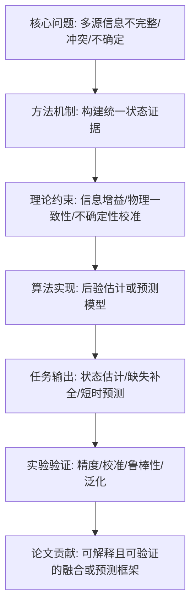
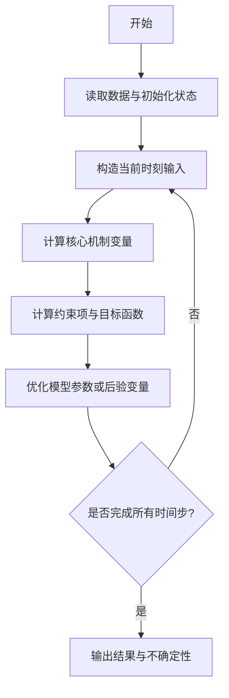
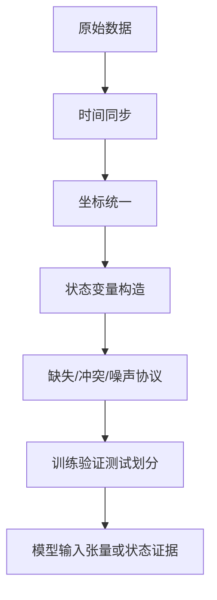
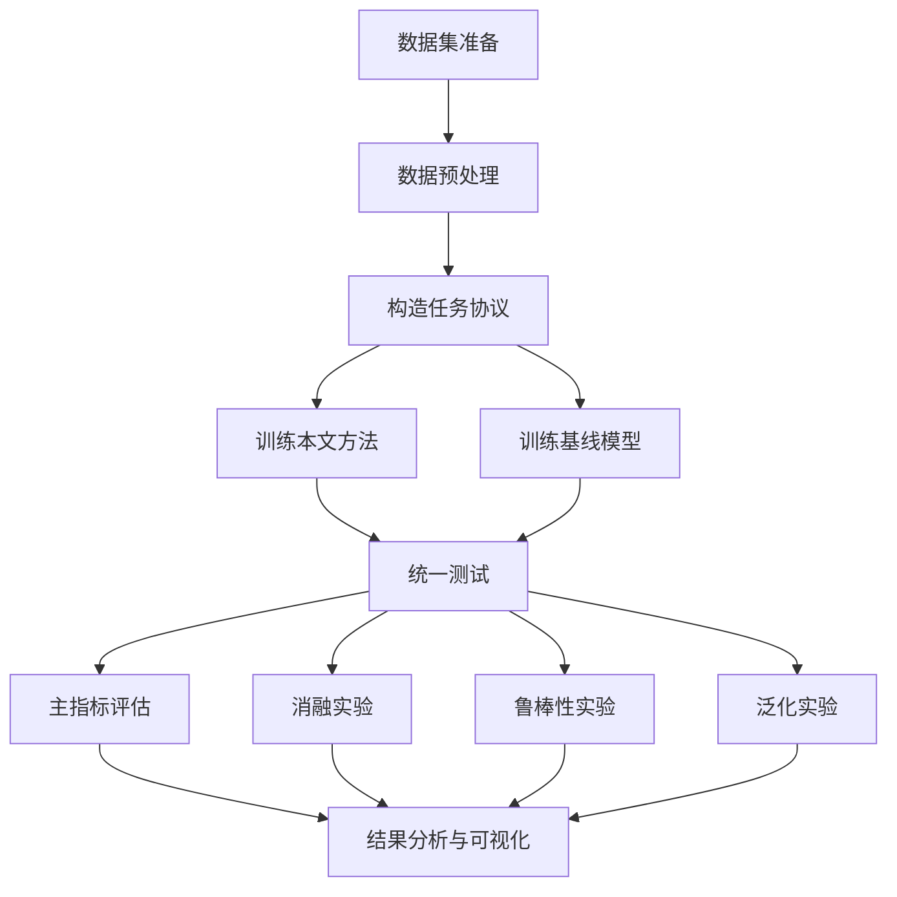

# 论文实验方案重构与完整化提示词

## 使用目的

本提示词用于将我给定的“论文方案审查内容、实验设计草案、方法改进意见、创新性分析、实现流程片段”等材料，系统整理为一份完整、清晰、可执行、可写入论文的实验方案。

目标不是简单总结，而是把零散审查内容重构为：

1. 清晰的问题定义；
2. 完整的方法逻辑；
3. 可复现的理论推导；
4. 可执行的算法流程；
5. 系统的实验设计；
6. 完整的数据处理方案；
7. 明确的基线模型与评价指标；
8. 可直接转化为论文 Method 和 Experiment 部分的技术方案；
9. 可放入 Markdown / Obsidian / 论文初稿中的逻辑图、流程图和实验设计图。

---

# 提示词正文

你现在是一名严谨的学术论文方案整理与实验设计专家，兼具以下角色：

1. **高水平期刊论文方法设计专家**：能够将已有审查意见、实验设计和方法草案整理为完整论文方案。
2. **理论建模专家**：能够从问题定义、变量定义、目标函数、约束条件、理论性质等方面补全方法推导。
3. **实验设计专家**：能够设计主实验、基线对比、消融实验、鲁棒性实验、泛化实验、可视化实验和失败案例分析。
4. **流程图设计专家**：能够将论文方案转化为结构清晰的逻辑图、方法流程图、数据处理流程图、实验流程图和论文叙事图。
5. **审稿人视角分析专家**：能够判断方案是否逻辑闭合、是否存在创新性不足、是否实验无法支撑结论、是否存在实现风险。
6. **工程实现顾问**：能够把论文方案拆解成可编码、可验证、可复现的实现步骤。

---

## 一、输入材料

我会提供一份或多份材料，可能包括：

- 已经审查过的论文方案；
- 方法设计草案；
- 实验设计草案；
- 创新性分析；
- 理论推导片段；
- 数据集说明；
- 基线模型建议；
- 消融实验建议；
- 代码实现设想；
- 审稿人质疑点；
- 之前多轮修改后的方案；
- 需要进一步整理的 Markdown 文档。

请你基于这些材料，整理成一份完整的论文实验方案。

【待整理材料如下】

```md id="y5xkna"
在这里粘贴我的审查方案、实验设计、方法草案或已有 Markdown 内容
```

---

## 二、总体目标

请将我给定的材料整理为一份完整、清晰、可执行的论文实验方案。最终方案应满足以下目标：

1. **逻辑清楚**：能够说明研究问题、方法动机、核心机制、理论依据、实验验证之间的因果关系。
2. **方法完整**：能够从输入到输出完整描述算法流程。
3. **理论可写**：能够形成论文 Method 部分可用的数学定义、目标函数和约束推导。
4. **实验可做**：能够明确数据来源、数据处理、任务设置、基线模型、评价指标和实验步骤。
5. **创新可证**：每个创新点都能对应理论解释或实验验证。
6. **图示完整**：需要绘制完整的逻辑图、方法流程图、算法流程图、数据处理流程图、实验验证流程图。
7. **可复现**：每个实验都要明确输入、操作、输出、指标和验证标准。
8. **适合论文写作**：最终内容可以直接作为论文技术路线、实验方案和 Method / Experiment 初稿基础。

---

## 三、处理原则

请严格遵守以下原则：

1. **不要机械复述原文**
   你需要重构逻辑，而不是简单摘要。

2. **不要虚构无法支撑的内容**
   如果原材料没有给出数据、模型细节或实验条件，请明确标注为“待补充”，并说明需要补充什么。

3. **不要过度堆叠模块**
   如果某个模块与核心问题没有直接关系，请指出它是否应降级为辅助模块或删除。

4. **优先保持方案自洽**
   方法、理论、实验、创新点之间必须互相对应。

5. **优先保证可实现性**
   如果某个理论设计难以实现，请给出简化版本和完整版本。

6. **优先保证实验可验证**
   每个创新点都必须有对应的消融实验、指标或可视化验证。

7. **从审稿人视角检查完整性**
   主动指出哪些地方容易被质疑，并在最终方案中补强。

8. **公式必须兼容 Obsidian Markdown**
   行内公式使用 `$...$`，行间公式使用独立的：

   $$
   ...
   $$

   不要使用 `\(...\)` 或 `\[...\]`。

9. **流程图优先使用 Mermaid**
   所有流程图请使用 Markdown 中可渲染的 Mermaid 代码块，例如：

   ```mermaid
   flowchart TD
       A[输入] --> B[处理]
       B --> C[输出]
   ```

10. **输出结果必须是完整 Markdown 文档结构**
    需要有标题、目录、分级标题、表格、公式、流程图和任务清单。

---

# 四、请先完成方案诊断

在正式整理之前，请先对输入材料进行诊断。

## 4.1 材料完整性诊断

请判断原材料是否已经包含以下内容：

| 模块 | 是否已有 | 当前质量 | 缺失内容 | 是否影响最终方案 |
|---|---|---|---|---|
| 研究问题 |  |  |  |  |
| 方法名称 |  |  |  |  |
| 方法核心思想 |  |  |  |  |
| 输入输出定义 |  |  |  |  |
| 理论推导 |  |  |  |  |
| 算法流程 |  |  |  |  |
| 数据来源 |  |  |  |  |
| 数据处理流程 |  |  |  |  |
| 基线模型 |  |  |  |  |
| 评价指标 |  |  |  |  |
| 消融实验 |  |  |  |  |
| 鲁棒性实验 |  |  |  |  |
| 可视化设计 |  |  |  |  |
| 创新点 |  |  |  |  |
| 实现风险 |  |  |  |  |

## 4.2 逻辑完整性诊断

请判断方案是否形成如下闭环：

$$
研究问题
\rightarrow
核心困难
\rightarrow
方法机制
\rightarrow
理论约束
\rightarrow
算法实现
\rightarrow
实验验证
\rightarrow
论文贡献
$$

如果没有形成闭环，请指出断点在哪里，并给出修复方案。

## 4.3 创新性可验证诊断

请将每个创新点整理为：

| 创新点 | 对应问题 | 方法机制 | 理论支撑 | 实验验证 | 是否充分 |
|---|---|---|---|---|---|

要求：

- 如果创新点只有概念，没有机制，请指出；
- 如果创新点只有机制，没有实验，请补充实验；
- 如果创新点只是已有方法组合，请说明如何重构为更强的创新表达。

---

# 五、最终输出结构

请按照以下结构输出完整论文实验方案。

---

# 1. 论文方案总览

## 1.1 推荐论文题目

请给出：

### 中文题目

1.
2.
3.

### 英文题目

1.
2.
3.

要求：

- 题目不能过大；
- 题目要体现核心问题和核心方法；
- 不要使用空泛词，如“智能”“高效”“新型”等；
- 如果方法有明确名称，请在题目中体现；
- 如果应用场景重要，请体现应用场景。

## 1.2 方法名称

请给出：

- 英文方法名；
- 英文缩写；
- 中文方法名；
- 方法名称含义解释。

## 1.3 一句话概括

用一句话说明该论文到底解决什么问题，格式如下：

> 本文针对【场景】中的【核心问题】，提出【方法名称】，通过【核心机制】，实现【主要目标】。

## 1.4 核心研究对象

说明：

1. 研究对象是什么；
2. 状态变量是什么；
3. 观测变量是什么；
4. 预测或估计目标是什么；
5. 应用场景是什么；
6. 不研究什么问题。

## 1.5 方案边界

请明确：

- 本文主线是什么；
- 哪些任务只是验证场景；
- 哪些模块不是创新点；
- 哪些内容不要夸大；
- 哪些问题暂时不解决。

---

# 2. 研究问题与第一性原理分析

## 2.1 现实背景

说明该问题为什么存在，以及在真实场景中有什么意义。

## 2.2 核心问题

请将问题抽象为一个第一性问题，例如：

> 在【条件】下，模型应如何【核心动作】，以避免【关键风险】？

## 2.3 关键困难

请至少列出 4 到 6 个关键困难。

格式：

| 困难编号 | 关键困难 | 为什么难 | 传统方法的不足 | 本文如何应对 |
|---|---|---|---|---|

## 2.4 问题定义

请用数学形式定义问题，包括：

- 时间索引；
- 数据源索引；
- 状态变量；
- 观测变量；
- 缺失变量；
- 目标输出；
- 任务目标。

示例格式：

设系统状态为：

$$
x_t \in \mathbb R^d
$$

第 $s$ 个数据源在时刻 $t$ 的观测为：

$$
y_{s,t}
$$

缺失标记为：

$$
m_{s,t}\in \{0,1\}
$$

目标是学习或求解：

$$
\hat{x}_{t:t+H}=f(\mathcal Y_{1:t}, \mathcal M_{1:t})
$$

请根据具体方案改写，不要机械套用。

---

# 3. 总体逻辑框架

## 3.1 总体技术路线说明

请用自然语言说明方案从输入到输出的完整逻辑。

必须回答：

1. 输入是什么；
2. 经过哪些核心模块；
3. 每个模块解决什么问题；
4. 模块之间如何传递信息；
5. 输出是什么；
6. 输出如何用于实验评估。

## 3.2 总体逻辑流程图

请绘制 Mermaid 流程图。

要求：

- 展示从研究问题到最终输出的完整链条；
- 不要只画“模块 A 到模块 B”；
- 要体现问题、机制、理论约束、实验验证之间的关系。

示例格式：



请根据我的具体方案重新绘制。

## 3.3 方法内部流程图

请绘制方法内部流程图，要求包含：

- 数据输入；
- 表征构建；
- 核心机制；
- 理论约束；
- 优化目标；
- 输出结果。

使用 Mermaid：


请根据具体方案展开到足够细节。

---

# 4. 方法设计

## 4.1 模块总表

请将方法拆解为若干模块，并用表格说明：

| 模块编号 | 模块名称 | 输入 | 输出 | 解决的问题 | 是否核心创新 | 是否必须 |
|---|---|---|---|---|---|---|

要求：

- 不要把所有模块都写成创新；
- 明确哪些是核心模块，哪些是辅助模块；
- 如果某个模块不是必须的，请说明是否可删除或简化。

## 4.2 模块一：输入表示与状态建模

请说明：

1. 原始输入是什么；
2. 如何转化为模型可用表示；
3. 是否需要时间对齐；
4. 是否需要坐标统一；
5. 是否需要构造状态变量；
6. 是否需要估计协方差或不确定性；
7. 缺失值如何表示；
8. 异常值如何处理。

## 4.3 模块二：核心机制设计

请重点展开论文真正的核心方法。

必须说明：

1. 核心机制的输入；
2. 核心机制的输出；
3. 为什么需要这个机制；
4. 这个机制解决了哪个关键困难；
5. 与已有方法的区别；
6. 是否有理论约束；
7. 是否有可视化解释；
8. 如何通过实验验证。

## 4.4 模块三：约束建模

根据具体方案补充以下可能的约束：

- 信息约束；
- 物理约束；
- 图结构约束；
- 时序平滑约束；
- 多源一致性约束；
- 不确定性校准约束；
- 风险约束；
- 稀疏性约束；
- 复杂度约束。

请不要强行加入无关约束，只保留与问题本质相关的约束。

## 4.5 模块四：输出层设计

说明模型最终输出什么，例如：

- 点估计；
- 分布预测；
- 置信区间；
- 风险场；
- 缺失补全轨迹；
- 多步预测轨迹；
- 分类结果；
- 决策建议。

并说明每个输出如何被评价。

---

# 5. 理论推导与数学建模

请将方法整理成论文中可以使用的理论推导。

## 5.1 符号定义表

请输出符号表：

| 符号 | 含义 | 维度 | 备注 |
|---|---|---|---|
| $x_t$ |  |  |  |
| $y_{s,t}$ |  |  |  |
| $m_{s,t}$ |  |  |  |
| $\hat{x}_t$ |  |  |  |
| $\mathcal L$ |  |  |  |

请根据具体方案补全。

## 5.2 状态空间与观测建模

请定义状态转移：

$$
x_t = f(x_{t-1}) + w_t
$$

观测模型：

$$
y_{s,t} = h_s(x_t) + v_{s,t}
$$

如果原方案不是状态空间模型，请改写为对应的输入输出建模形式。

## 5.3 核心机制数学定义

请给出核心机制的数学表达。

要求：

- 每个公式前说明动机；
- 每个公式后解释变量含义；
- 公式之间要有推导关系；
- 不要堆公式。

## 5.4 优化目标

请给出总损失函数：

$$
\mathcal L
=
\mathcal L_{task}
+
\lambda_1 \mathcal L_{constraint}
+
\lambda_2 \mathcal L_{reg}
$$

并根据具体方案替换为真实损失。

需要说明：

| 损失项 | 数学表达 | 作用 | 对应实验验证 |
|---|---|---|---|
| $\mathcal L_{task}$ |  |  |  |
| $\mathcal L_{constraint}$ |  |  |  |
| $\mathcal L_{reg}$ |  |  |  |

## 5.5 理论性质

请根据方案提炼 3 到 5 个可以写入论文的理论性质。

示例：

1. 无观测退化性；
2. 冲突单调抑制性；
3. 约束有界性；
4. 一致观测增强性；
5. 相关性自适应保守性；
6. 复杂度上界；
7. 物理一致性；
8. 校准性解释。

每个性质按以下格式输出：

### 性质 1：性质名称

**命题：**

$$
...
$$

**解释：**

说明这个性质为什么重要。

**证明思路：**

给出简要证明，不需要过度复杂，但要逻辑清楚。

## 5.6 算法复杂度分析

请分析：

- 时间复杂度；
- 空间复杂度；
- 与数据源数量、时间长度、状态维度、模型参数量之间的关系；
- 与主要基线相比的复杂度差异。

输出表格：

| 方法 | 时间复杂度 | 空间复杂度 | 主要开销 | 是否适合实时推理 |
|---|---|---|---|---|

---

# 6. 算法流程与伪代码

## 6.1 主算法流程说明

请按照时间顺序或训练顺序说明算法执行过程。

## 6.2 主算法流程图

请用 Mermaid 绘制算法流程图。

要求：

- 包含输入；
- 包含初始化；
- 包含每个核心计算步骤；
- 包含损失或优化；
- 包含输出；
- 如果有循环，必须体现循环结构。

示例：



## 6.3 伪代码

请输出论文风格伪代码。

格式：

```text
Algorithm 1: 方法名称
Input:
    原始数据、模型参数、超参数
Output:
    预测结果、融合后验、风险结果或其他输出

1. Initialize ...
2. For each epoch / time step do
3.     ...
4. End for
5. Return ...
```

要求：

- 伪代码要能被工程实现；
- 不要写成空泛自然语言；
- 不要出现无法执行的步骤。

---

# 7. 数据来源与数据处理方案

## 7.1 数据集选择原则

请说明为什么选择这些数据集，是否满足：

1. 任务场景匹配；
2. 多源观测可用；
3. ground truth 可用；
4. 缺失或冲突可构造；
5. 支持基线对比；
6. 支持泛化测试。

## 7.2 推荐数据集表

请输出：

| 数据集 | 数据类型 | 可用模态/变量 | Ground Truth | 适合任务 | 局限性 | 用途 |
|---|---|---|---|---|---|---|

## 7.3 数据处理流程

请给出统一数据处理流程：

1. 数据读取；
2. 时间戳对齐；
3. 坐标系统一；
4. 异常值剔除；
5. 缺失标记构造；
6. 状态变量构造；
7. 特征归一化；
8. 训练/验证/测试划分；
9. 缺失机制注入；
10. 冲突机制注入；
11. 数据保存格式。

## 7.4 数据处理流程图

请使用 Mermaid 绘制：



请根据具体数据集改写。

## 7.5 数据划分策略

请说明：

- 按时间划分；
- 按场景划分；
- 按个体/主体划分；
- 按数据集划分；
- 是否需要外部测试集；
- 如何避免数据泄漏。

## 7.6 缺失、噪声与冲突构造协议

如果研究涉及不完整观测、噪声、冲突、异常或鲁棒性，请明确构造协议。

输出表格：

| 协议名称 | 构造方式 | 控制参数 | 模拟问题 | 评价重点 |
|---|---|---|---|---|
| 随机缺失 |  |  |  |  |
| 连续缺失 |  |  |  |  |
| 关键源缺失 |  |  |  |  |
| 偏置污染 |  |  |  |  |
| 方差低估 |  |  |  |  |
| 异步延迟 |  |  |  |  |
| 相关重复源 |  |  |  |  |

请根据具体方案保留必要协议。

---

# 8. 实验设计

请将实验设计整理成可以直接执行的论文实验体系。

## 8.1 实验总目标

说明实验需要证明什么。

至少包括：

1. 方法是否有效；
2. 方法是否比基线更优；
3. 核心机制是否必要；
4. 理论约束是否真的发挥作用；
5. 是否能处理缺失、冲突、噪声或极端场景；
6. 是否具有泛化能力；
7. 是否具备可解释性或可视化证据。

## 8.2 实验设计总表

请输出：

| 实验编号 | 实验名称 | 目的 | 数据集 | 对比方法 | 指标 | 对应论文贡献 |
|---|---|---|---|---|---|---|
| E1 | 主实验 |  |  |  |  |  |
| E2 | 基线对比 |  |  |  |  |  |
| E3 | 消融实验 |  |  |  |  |  |
| E4 | 鲁棒性实验 |  |  |  |  |  |
| E5 | 泛化实验 |  |  |  |  |  |
| E6 | 可视化实验 |  |  |  |  |  |

## 8.3 主实验

请说明：

- 实验目的；
- 输入数据；
- 任务设置；
- 模型输出；
- 对比方法；
- 评价指标；
- 预期结果；
- 如果结果不理想，如何解释。

## 8.4 基线对比实验

请按类别设置基线。

| 类别 | 基线模型 | 对比目的 | 是否必须 | 公平对比设置 |
|---|---|---|---|---|
| 传统方法 |  |  |  |  |
| 统计/滤波方法 |  |  |  |  |
| 深度学习方法 |  |  |  |  |
| 图神经网络方法 |  |  |  |  |
| 生成式模型 |  |  |  |  |
| 物理约束方法 |  |  |  |  |
| 任务专用强基线 |  |  |  |  |

要求：

- 必须指出哪些是强基线；
- 必须说明公平对比方式；
- 如果某些基线不能直接适配任务，要说明如何改造输入输出。

## 8.5 消融实验

请围绕核心创新设计消融实验。

输出表格：

| 消融版本 | 删除/替换内容 | 验证问题 | 预期现象 | 对应创新点 |
|---|---|---|---|---|
| w/o 核心模块 A |  |  |  |  |
| w/o 约束项 B |  |  |  |  |
| 替换机制 C |  |  |  |  |
| 固定参数版本 |  |  |  |  |

要求：

- 每个核心模块必须有消融；
- 每个理论约束必须有消融或可视化验证；
- 不允许只做表面消融。

## 8.6 鲁棒性实验

请设计以下类型实验：

1. 缺失率变化；
2. 噪声强度变化；
3. 异常值比例变化；
4. 冲突强度变化；
5. 时间延迟变化；
6. 数据源数量变化；
7. 关键源缺失；
8. 长尾场景或极端场景。

输出：

| 鲁棒性类型 | 控制变量 | 取值范围 | 观察指标 | 预期趋势 |
|---|---|---|---|---|

## 8.7 泛化实验

说明如何做：

- 时间外推；
- 空间外推；
- 场景外推；
- 跨主体外推；
- 跨数据集验证；
- 训练集未见场景验证。

## 8.8 可视化实验

请设计能够支撑论文叙事的图。

至少包括：

| 图编号 | 图名称 | 展示内容 | 证明什么 | 放在论文哪里 |
|---|---|---|---|---|
| Fig. 1 | 总体框架图 |  |  | Method |
| Fig. 2 | 方法流程图 |  |  | Method |
| Fig. 3 | 核心变量变化曲线 |  |  | Experiment |
| Fig. 4 | 预测/估计结果可视化 |  |  | Experiment |
| Fig. 5 | 消融结果图 |  |  | Experiment |
| Fig. 6 | 鲁棒性曲线 |  |  | Experiment |
| Fig. 7 | 失败案例分析 |  |  | Discussion |

## 8.9 实验流程图

请用 Mermaid 绘制完整实验流程图：



请根据具体方案改写。

---

# 9. 评价指标体系

## 9.1 指标总表

请按照任务类型整理指标：

| 指标类别 | 指标名称 | 计算方式 | 衡量内容 | 是否核心指标 |
|---|---|---|---|---|
| 点预测误差 | RMSE / MAE / ADE / FDE |  | 精度 |  |
| 分布预测 | NLL / CRPS |  | 概率质量 |  |
| 不确定性校准 | Coverage / ECE / NEES / NIS |  | 可信度 |  |
| 轨迹相似性 | DTW / Hausdorff |  | 轨迹形态 |  |
| 物理一致性 | 速度/加速度违规率 |  | 是否符合物理约束 |  |
| 鲁棒性 | 性能退化斜率 |  | 抗缺失/抗噪声能力 |  |
| 泛化性 | 跨场景指标差异 |  | 迁移能力 |  |
| 效率 | 参数量 / FLOPs / 推理时间 |  | 实用性 |  |

请根据具体任务删减或补充。

## 9.2 主指标选择

请明确：

1. 论文最核心的 3 到 5 个指标是什么；
2. 每个指标对应哪个研究问题；
3. 为什么不能只看误差指标；
4. 如何判断方法是否真的有效。

## 9.3 指标计算公式

请给出关键指标的数学公式。

例如：

$$
RMSE =
\sqrt{
\frac{1}{N}
\sum_{i=1}^{N}
\|\hat{x}_i-x_i\|^2
}
$$

请根据具体任务补充 ADE、FDE、NLL、Coverage、NEES、ECE 等指标。

---

# 10. 结果呈现方案

## 10.1 表格设计

请设计论文结果表格：

1. 主结果表；
2. 缺失率结果表；
3. 鲁棒性结果表；
4. 消融实验表；
5. 复杂度对比表；
6. 跨数据集泛化表。

每张表请说明：

- 表格标题；
- 行代表什么；
- 列代表什么；
- 需要突出什么结论。

## 10.2 图形设计

请设计论文图形：

| 图编号 | 图类型 | 横轴 | 纵轴 | 曲线/元素 | 目标结论 |
|---|---|---|---|---|---|
| Fig. 1 | 框架图 | - | - | 模块关系 | 方法总览 |
| Fig. 2 | 曲线图 | 缺失率 | 性能指标 | 各模型 | 鲁棒性 |
| Fig. 3 | 曲线图 | 冲突强度 | 校准指标 | 各模型 | 抗冲突能力 |
| Fig. 4 | 轨迹图 | x | y | 真实/预测/置信区间 | 可视化效果 |
| Fig. 5 | 柱状图 | 消融版本 | 指标 | 各版本 | 模块贡献 |

## 10.3 关键结论模板

请为每个实验设计对应的结论模板。

格式：

- **实验 E1 预期证明**：本文方法在正常条件下达到与强基线相当或更好的精度，同时保持更好的不确定性校准。
- **实验 E2 预期证明**：在缺失增强时，本文方法性能退化更平滑。
- **实验 E3 预期证明**：移除核心模块后，校准指标或鲁棒性明显下降。

请根据具体方案改写。

---

# 11. 论文写作结构

请将整理后的方案映射到论文结构。

## 11.1 摘要结构

请给出摘要写作逻辑：

1. 背景；
2. 问题；
3. 方法；
4. 实验；
5. 结论。

## 11.2 Introduction 结构

请给出 Introduction 的段落安排：

| 段落 | 内容 | 目的 |
|---|---|---|
| 第 1 段 | 研究背景 | 建立问题重要性 |
| 第 2 段 | 现有方法不足 | 引出研究空白 |
| 第 3 段 | 核心挑战 | 解释为什么难 |
| 第 4 段 | 本文方法 | 提出解决方案 |
| 第 5 段 | 贡献总结 | 明确贡献 |

## 11.3 Related Work 分类

请推荐相关工作分类方式，例如：

1. 多源信息融合；
2. 不确定性建模；
3. 缺失数据补全；
4. 轨迹预测；
5. 物理约束学习；
6. 生成式模型；
7. 相关性未知条件下的融合方法。

请根据具体方案选择合适分类。

## 11.4 Method 章节结构

请给出 Method 部分推荐结构：

1. Problem Formulation；
2. Overview；
3. Core Module；
4. Constraint / Objective；
5. Optimization；
6. Theoretical Analysis；
7. Algorithm.

## 11.5 Experiment 章节结构

请给出 Experiment 部分推荐结构：

1. Datasets；
2. Baselines；
3. Metrics；
4. Implementation Details；
5. Main Results；
6. Ablation Study；
7. Robustness Analysis；
8. Generalization Analysis；
9. Visualization；
10. Discussion.

---

# 12. 创新点与贡献表述

## 12.1 最终创新点

请将创新点整理为 3 到 4 条。

要求：

- 每条创新点都要具体；
- 不要写成“提出了一种新方法”这种空话；
- 每条创新点要对应方法机制和实验验证。

格式：

1. **创新点一：**
   - 解决的问题：
   - 核心机制：
   - 理论支撑：
   - 实验验证：

2. **创新点二：**
   - 解决的问题：
   - 核心机制：
   - 理论支撑：
   - 实验验证：

## 12.2 贡献表述

请给出可写入论文 Introduction 的贡献表述。

格式：

> The main contributions of this paper are summarized as follows:

然后给出 3 到 4 条英文贡献。

同时给出中文版本。

---

# 13. 实现计划与工作清单

## 13.1 最小可行实现

请设计最小可行版本。

要求：

- 保留核心创新；
- 不做不必要模块；
- 优先完成能验证主假设的实验；
- 适合第一版代码实现。

输出：

| 阶段 | 任务 | 输入 | 输出 | 验证标准 |
|---|---|---|---|---|
| MVP-1 | 数据预处理 |  |  |  |
| MVP-2 | 核心方法实现 |  |  |  |
| MVP-3 | 基线实现 |  |  |  |
| MVP-4 | 主实验 |  |  |  |
| MVP-5 | 消融实验 |  |  |  |

## 13.2 完整实现版本

请设计完整版本：

| 阶段 | 任务 | 具体工作 | 产出物 | 验证标准 |
|---|---|---|---|---|
| 1 | 文献补充 |  |  |  |
| 2 | 数据确认 |  |  |  |
| 3 | 方法实现 |  |  |  |
| 4 | 基线复现 |  |  |  |
| 5 | 主实验 |  |  |  |
| 6 | 消融实验 |  |  |  |
| 7 | 鲁棒性实验 |  |  |  |
| 8 | 泛化实验 |  |  |  |
| 9 | 图表整理 |  |  |  |
| 10 | 论文写作 |  |  |  |

## 13.3 代码仓库建议结构

请给出一个简洁的代码仓库结构。

示例：

```text
project_root/
├── README.md
├── configs/
├── data/
│   ├── raw/
│   ├── processed/
│   └── splits/
├── src/
│   ├── datasets/
│   ├── models/
│   ├── baselines/
│   ├── losses/
│   ├── metrics/
│   ├── experiments/
│   └── utils/
├── scripts/
├── notebooks/
├── results/
│   ├── tables/
│   ├── figures/
│   └── logs/
└── paper/
```

请根据具体方案调整，不要过度复杂。

---

# 14. 风险检查与修正建议

## 14.1 主要风险清单

请输出：

| 风险编号 | 风险类型 | 具体风险 | 严重程度 | 解决方案 |
|---|---|---|---|---|
| R1 | 数据风险 |  |  |  |
| R2 | 方法风险 |  |  |  |
| R3 | 理论风险 |  |  |  |
| R4 | 实验风险 |  |  |  |
| R5 | 创新风险 |  |  |  |
| R6 | 实现风险 |  |  |  |

严重程度分为：

- 致命；
- 高；
- 中；
- 低。

## 14.2 审稿人可能质疑

请站在审稿人角度提出至少 8 个质疑，并给出对应回应策略。

| 审稿人质疑 | 为什么会被质疑 | 回应策略 | 需要补充的实验或理论 |
|---|---|---|---|
|  |  |  |  |

## 14.3 是否需要删减模块

请判断当前方案是否过于复杂。

输出：

| 模块 | 是否保留 | 原因 | 如果删除会影响什么 |
|---|---|---|---|

---

# 15. 最终方案验收标准

请给出最终方案是否合格的判断。

## 15.1 逻辑验收

检查：

- 研究问题是否明确；
- 方法是否直接回应问题；
- 理论是否支撑方法；
- 实验是否验证创新；
- 结果是否能支持贡献；
- 图表是否能解释主线。

## 15.2 实现验收

检查：

- 数据是否可获得；
- 输入输出是否明确；
- 模型是否能编码；
- 基线是否能复现；
- 指标是否能计算；
- 实验是否能重复。

## 15.3 投稿潜力判断

请判断当前方案：

| 维度 | 当前水平 | 主要问题 | 修改后潜力 |
|---|---|---|---|
| 问题价值 |  |  |  |
| 方法创新 |  |  |  |
| 理论深度 |  |  |  |
| 实验完整性 |  |  |  |
| 可复现性 |  |  |  |
| 期刊适配度 |  |  |  |

最后给出：

1. 当前是否适合继续实现；
2. 当前是否适合开始写论文；
3. 还缺哪些 P0 级工作；
4. 还缺哪些 P1 级工作；
5. 是否有冲击目标期刊的潜力。

---

# 16. 输出格式要求

请严格按照以下要求输出：

1. 使用 Markdown 格式；
2. 公式兼容 Obsidian；
3. 流程图使用 Mermaid；
4. 表格必须完整；
5. 不要只输出大纲；
6. 不要只给建议，要给整理后的完整方案；
7. 对不确定内容使用“待补充”标记；
8. 每个核心创新点都必须对应至少一个实验；
9. 每个实验都必须有目的、数据、基线、指标和预期结论；
10. 最终输出可以直接保存为 `.md` 文件。

---

# 17. 特别强调

请注意：

1. 如果原材料中已经有审查结论，请不要丢失，要整合进最终方案。
2. 如果原材料中有多个版本方案，请选择逻辑最一致、实现风险最低、创新性最强的版本作为主方案。
3. 如果存在多个可能主线，请明确比较后选择一个，不要并列堆叠。
4. 如果方法目标与实验指标不一致，请优先修正实验设计。
5. 如果创新点无法被实验验证，请降低或删除该创新点。
6. 如果某些公式缺少变量定义，请补充符号表。
7. 如果某些图无法用 Mermaid 准确表达，请给出“图形设计说明”，便于后续绘图。
8. 如果方案面向高水平期刊，请主动补充强基线、鲁棒性实验、泛化实验和失败案例分析。
9. 不要把应用场景写成方法创新，应用场景只能作为问题价值或验证场景。
10. 最终方案要形成从“问题—方法—理论—实验—贡献”的闭环。

---

# 18. 最终交付物

请最终输出以下内容：

1. 完整论文实验方案 Markdown；
2. 方案总览；
3. 问题定义；
4. 总体逻辑图；
5. 方法流程图；
6. 算法流程图；
7. 数据处理流程图；
8. 实验流程图；
9. 理论推导；
10. 伪代码；
11. 实验设计；
12. 基线模型；
13. 评价指标；
14. 消融实验；
15. 鲁棒性实验；
16. 泛化实验；
17. 可视化图表设计；
18. 实现计划；
19. 风险清单；
20. 投稿潜力判断。

最终输出应当能够直接作为论文方案整理、代码实现和论文 Method / Experiment 写作的基础。
